Cockpit is an intermediate Proving Grounds box, also rated as intermediate by the community. This machine involves SQL injection to gain access to an in-browser terminal where we exploit `tar` checkpoints for privilege escalation.

`nmap` scan:

```
nmap <target ip> -sC -sV -sS -Pn -p-
```

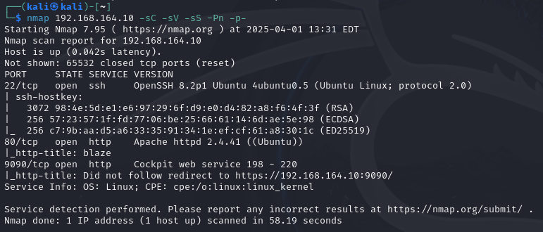

Ports `80` and `9090` seem to be using `http`. Let's check out port `80`:

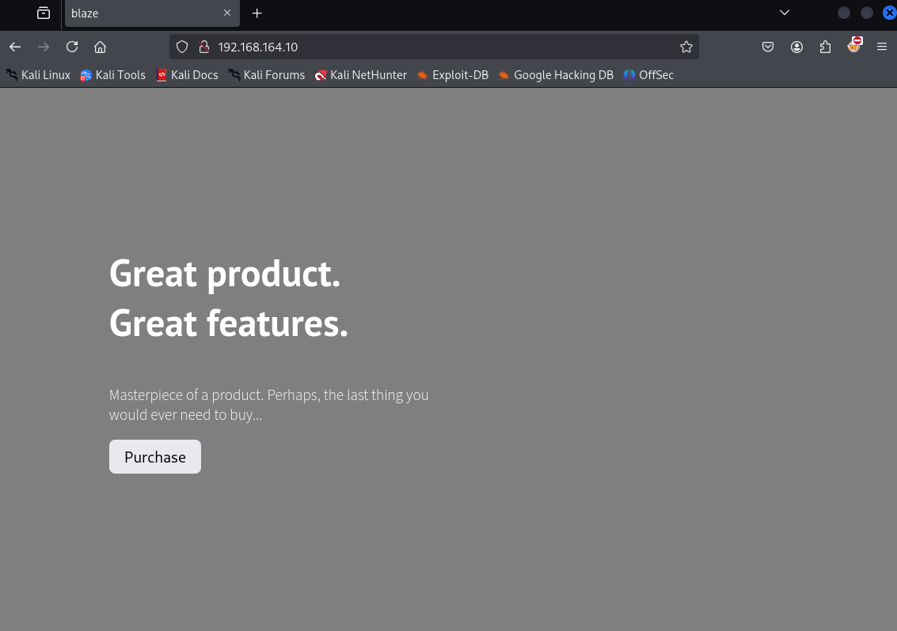

Run `dirsearch` on this port:

```
python3 dirsearch.py -u <target ip> -e html,php -x 400,401,403
```

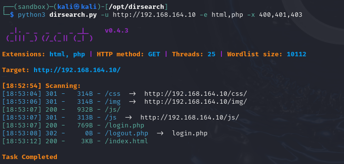

Seems like there's a `/login` page. Let's visit it:

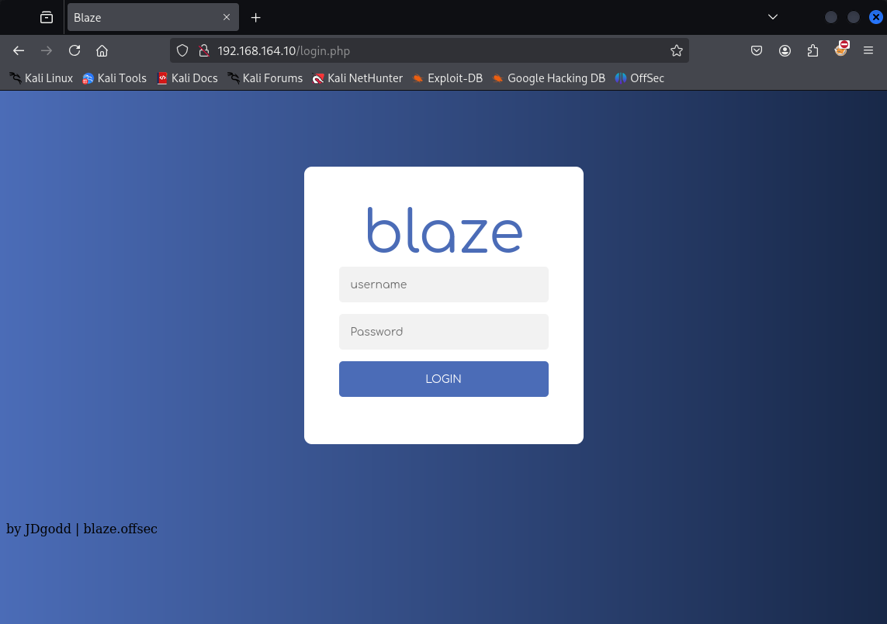

Tried logging in with default credentials (`admin`:`admin`, etc.) but to no avail. However, testing a single `'` for SQL injection gave us an interesting output:

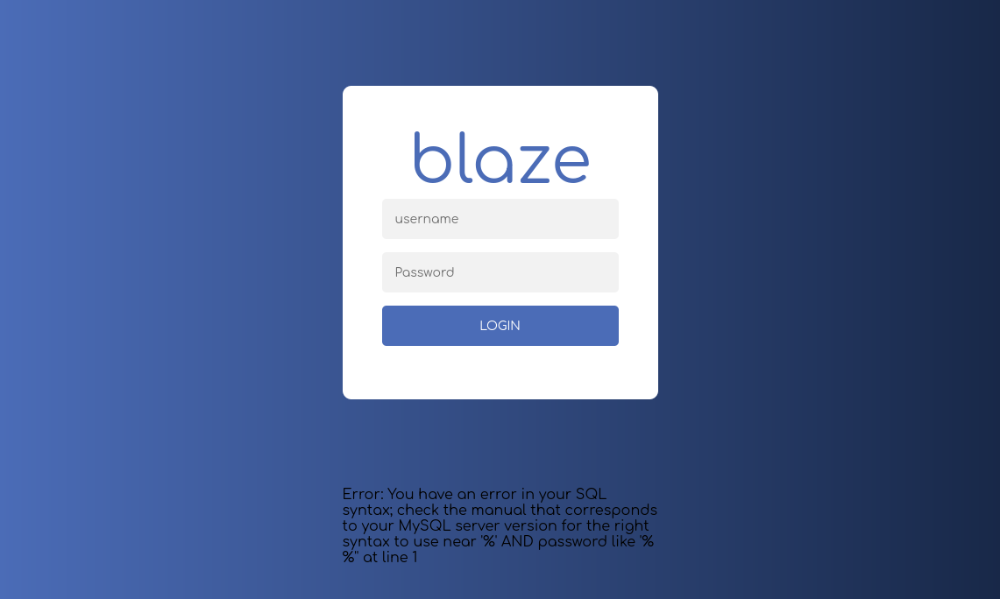

There is great potential for SQL injection.

To bypass this login field, we can search up common SQL injection inputs by googling `mysql login bypass seclist`:

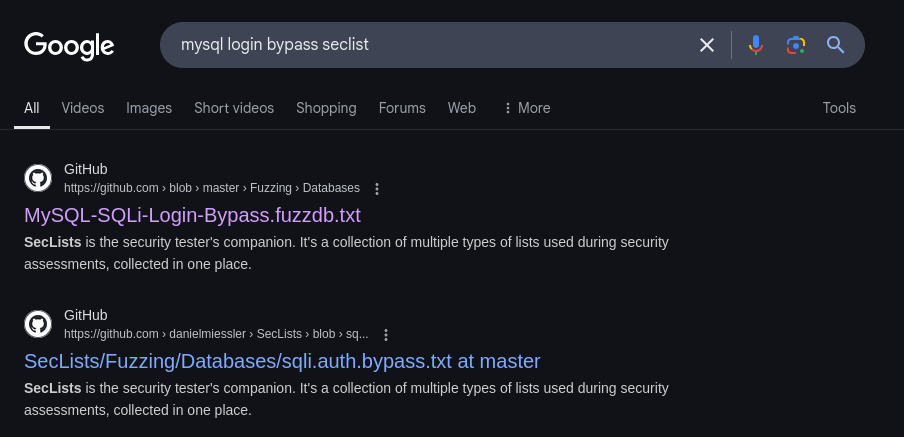

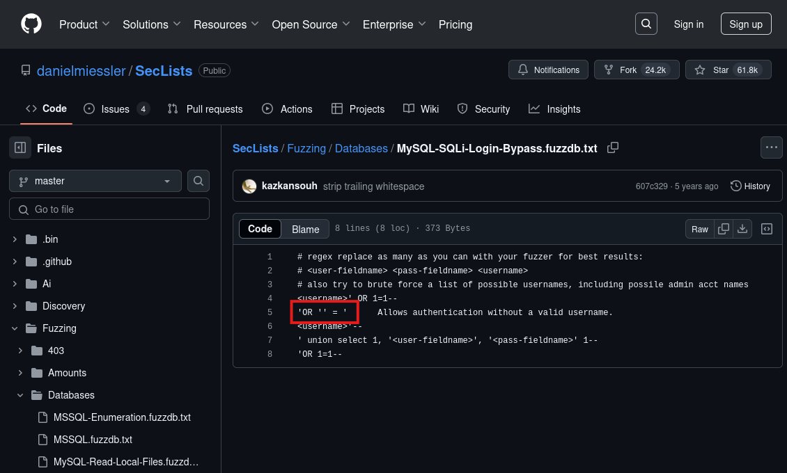

In short, plugging in `'OR '' = '` will replace credential placeholders within the SQL database code with a `true` statement allowing us to bypass the login fields, provided the fields have not been sanitized yet.

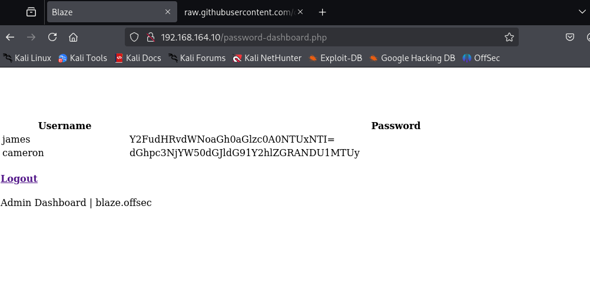

We bypass the login page and land on a set of credentials. Taking the first password, it looks like it's `base64` encoded because of the trailing `=` character. Decode it with:

```
echo 'Y2FudHRvdWNoaGh0aGlzc0A0NTUxNTI=' | base64 -d
```

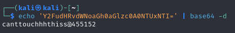

```
canttouchhhthiss@455152
```

If we try to `ssh` with the username `james` into the target machine, we get denied:

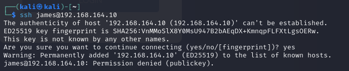

There's still another `http` port we haven't tried, `9090`:

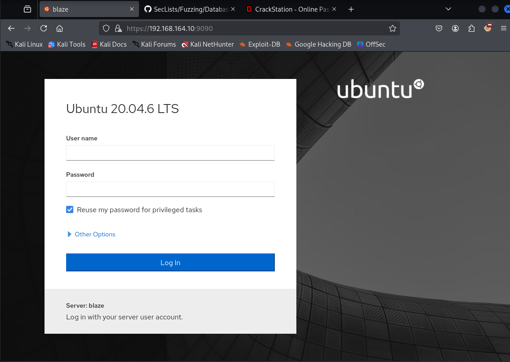

With `james` as the User name and `canttouchhhthiss@455152` as the Password we're able to log in.

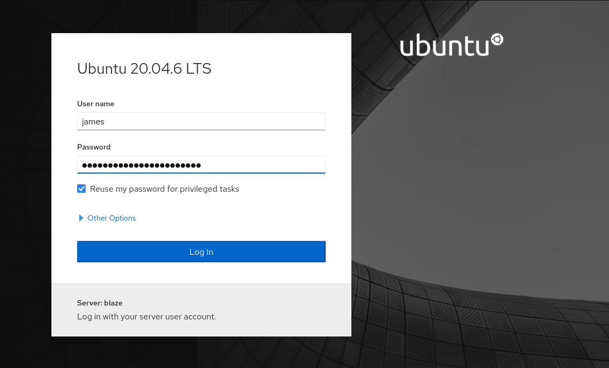

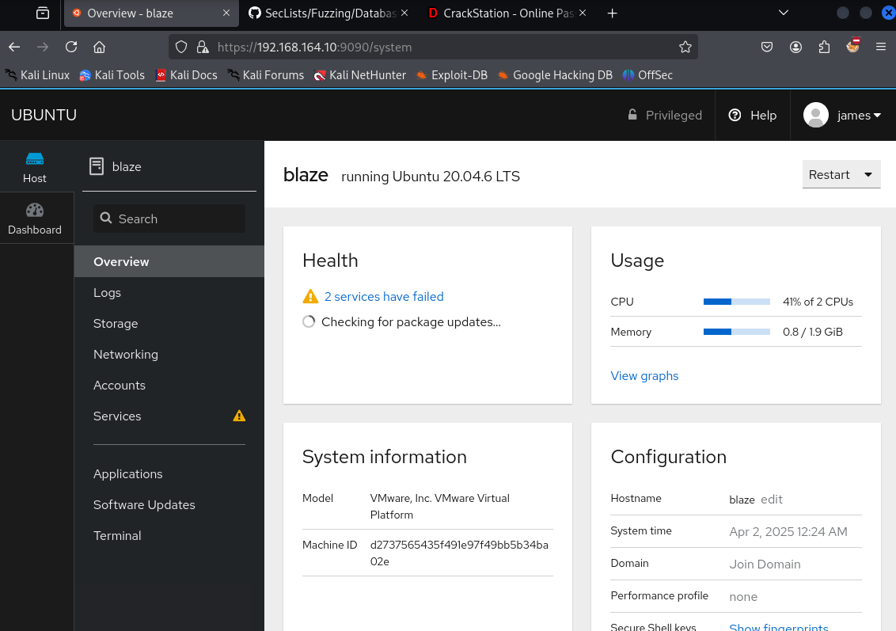

In the left sidebar, we can see a Terminal option. Clicking on it gives us an in-browser shell:

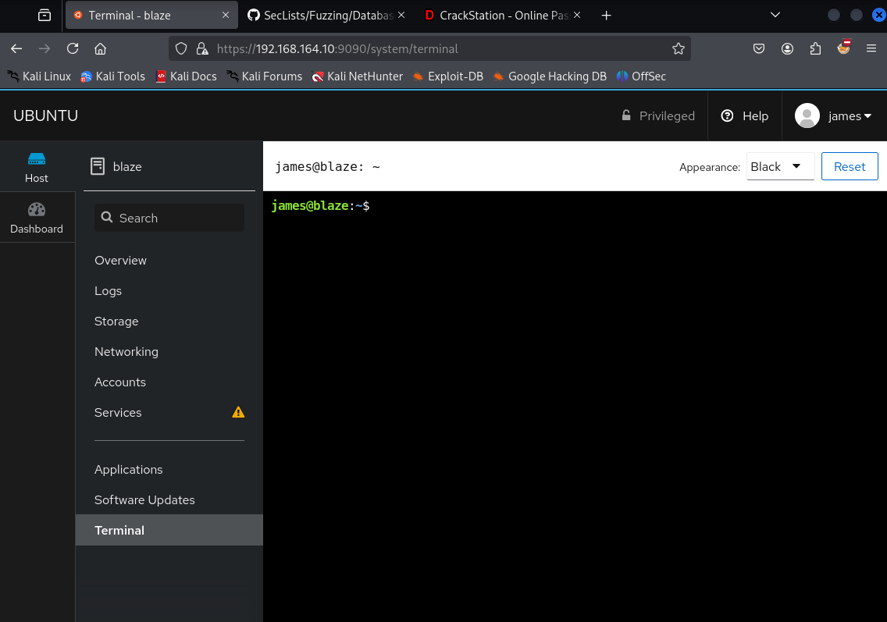

Grab `local.txt` and find out what `sudo` commands we can use as `james`:

```
sudo -l
```

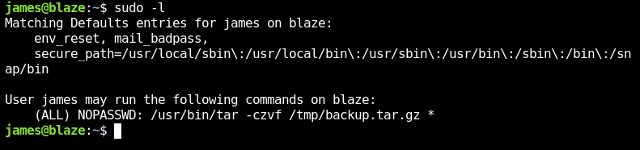

The `tar` command seems usable by `james` through `sudo`, so let's visit `gtfobins` for more info:

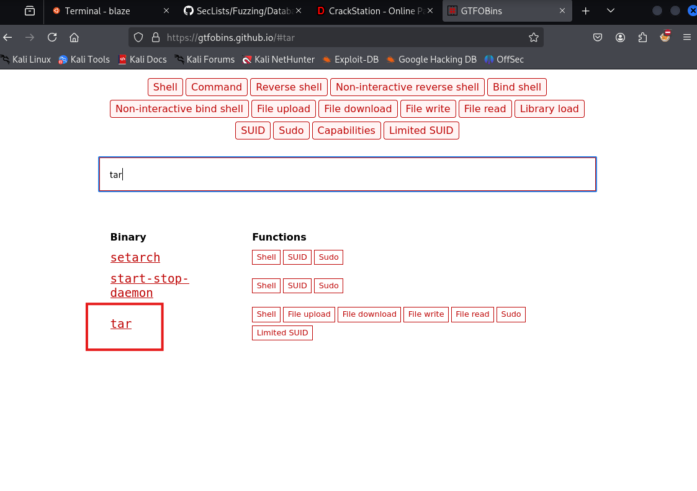

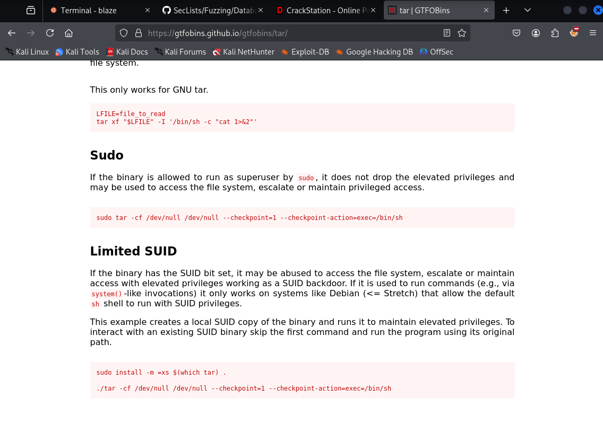

`cd` into `/tmp` and create a file called `payload.sh`. Paste the following line into it:

```
echo 'james ALL=(root) NOPASSWD: ALL' > /etc/sudoers
```

This will essentially grant `james` all `root` permissions if we're able to successfully execute it.

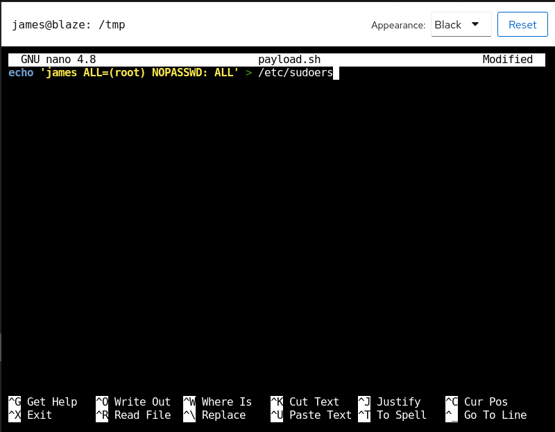

A quick rundown on the `tar` command:

`--checkpoint=<N>` will tell `tar` to run a checkpoint every `N` files it processes, or in this case "archives". If we have the line `--checkpoint-action=exec=sh payload.sh`, this will tell `tar` to run `payload.sh` once the checkpoints have been reached. What's listed under the `sudo -l` command tells us that we can use `tar` but only under strict conditions: it must be run with `-czvf /tmp/backup.tar.gz *` which means we're only allowed to make a compressed archive of files in the current directory under `/tmp/backup.tar.gz`. But, `*` is key because it expands into every file in the directory. So, by cleverly naming empty files to `--checkpoint=<N>` and `--checkpoint-action=exec=sh payload.sh`, we can execute what's inside of `payload.sh`.

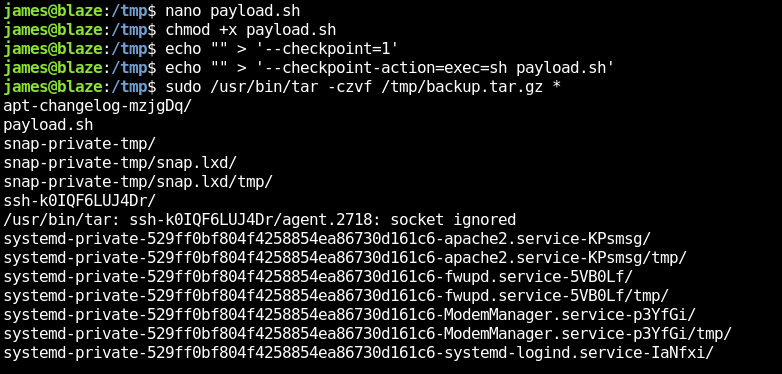

By checking `sudo -l` after executing `payload.sh`, we can see that all commands can be ran under `root` with no password. So, all we need to do is spawn a shell as `sudo`, and we'll be logged in as `root`. `cd` into `/root` and we grab the flag.

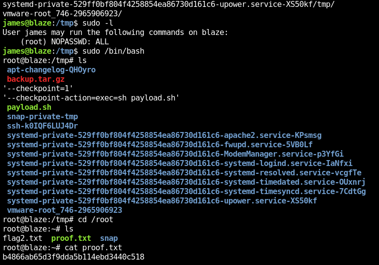

Rooted! :partying_face:
