Extplorer is an intermediate Proving Grounds box, also rated as intermediate by the community. This box exploits the `disk` group once we gain the initial foothold. It leads to accessing contents of `/etc/shadow` as `root` where we can escalate privileges.

`nmap` scan:

```
nmap <target ip> -sS -sC -sV -Pn -p-
```

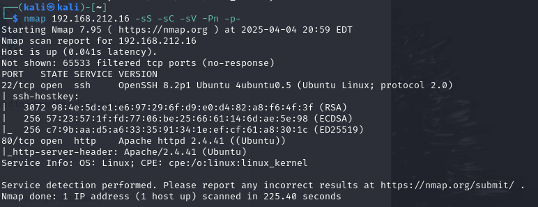

Port `80` is open so we check that.

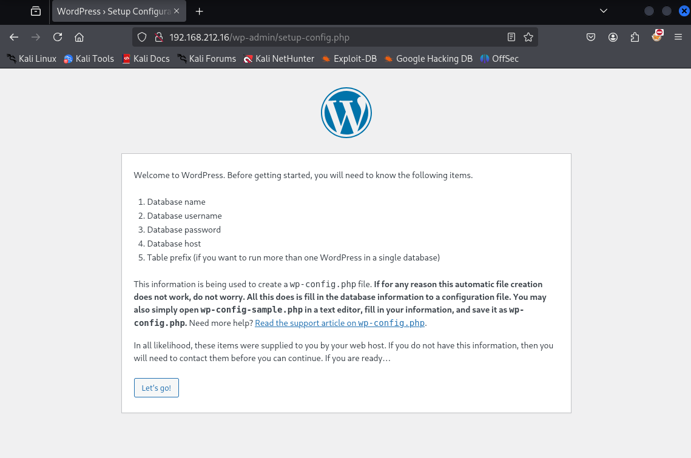

Seems like the website is using WordPress, could use `wpscan` to find potential vulnerabilities.

Let's `dirsearch` on this `url`:

```
python3 dirsearch.py -u <target ip> -e html,php -x 400,401,403,404
```

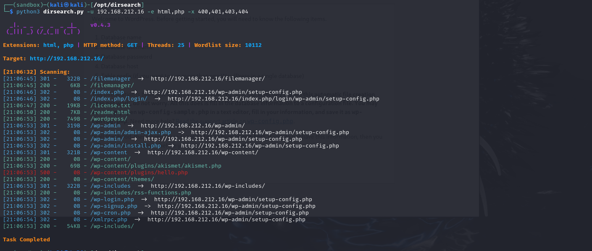

Check out `/filemanager` first:

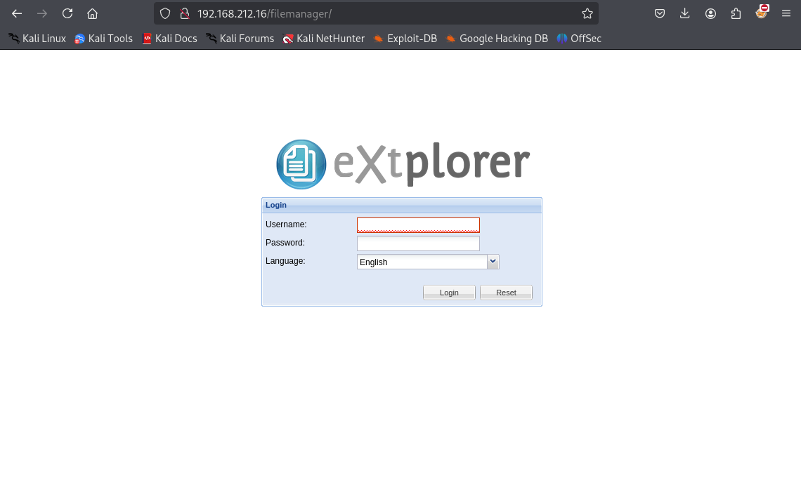

A login field... Can we use default credentials (`admin`:`admin`)?

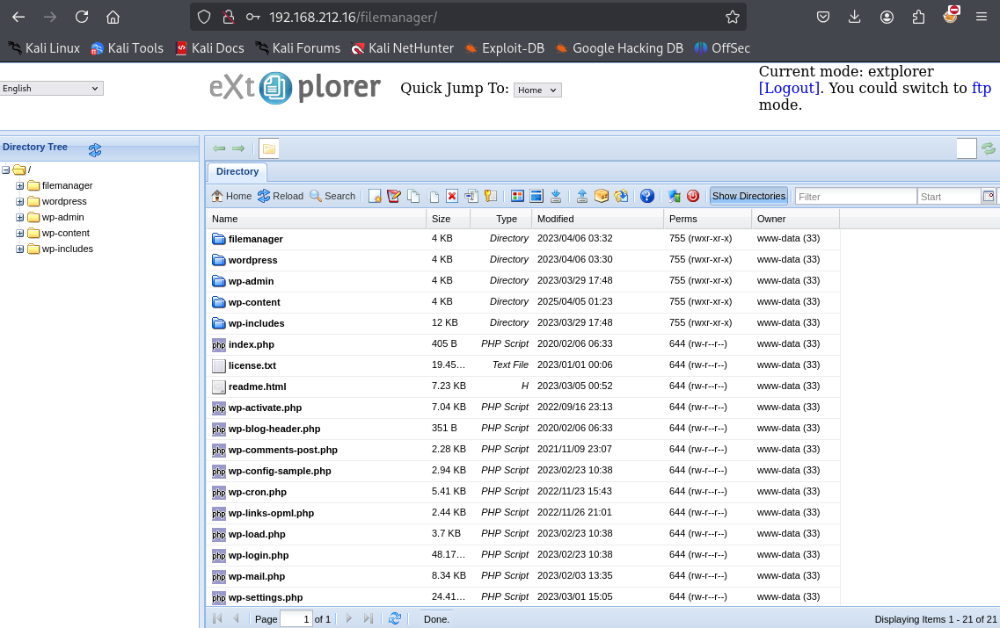

Nice, we can!

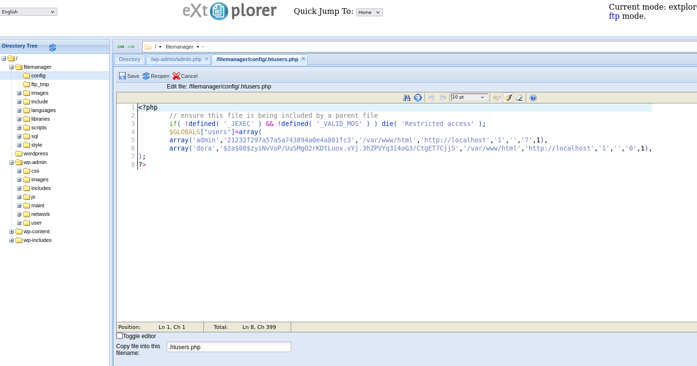

After clicking around a bit, it seems like under the `filemanager` folder there's another folder called `config` which seems interesting. Inside of `.htusers.php` we have what looks like 2 pairs of username and hashed password credentials. We know that the password for `admin` is `admin` since we used it to log in, so let's take a look at `dora`. Store the password into a file:

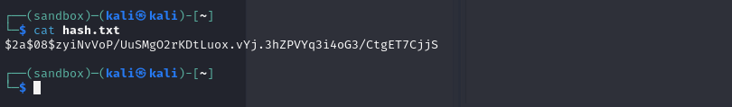

Any password cracker should work. We'll use `john` this time:

```
john hash.txt --wordlist=/usr/share/wordlists/rockyou.txt
```

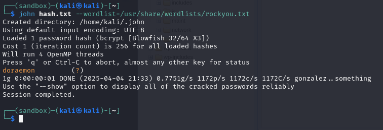

Maybe we have a password for `dora`? Try `ssh`:

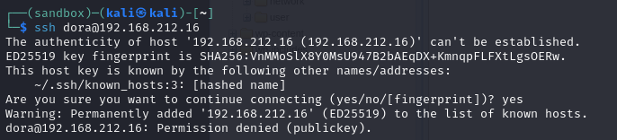

Seems like we need a private key to log in as `dora`. Try other avenues, maybe we can upload files on `extplorer`:

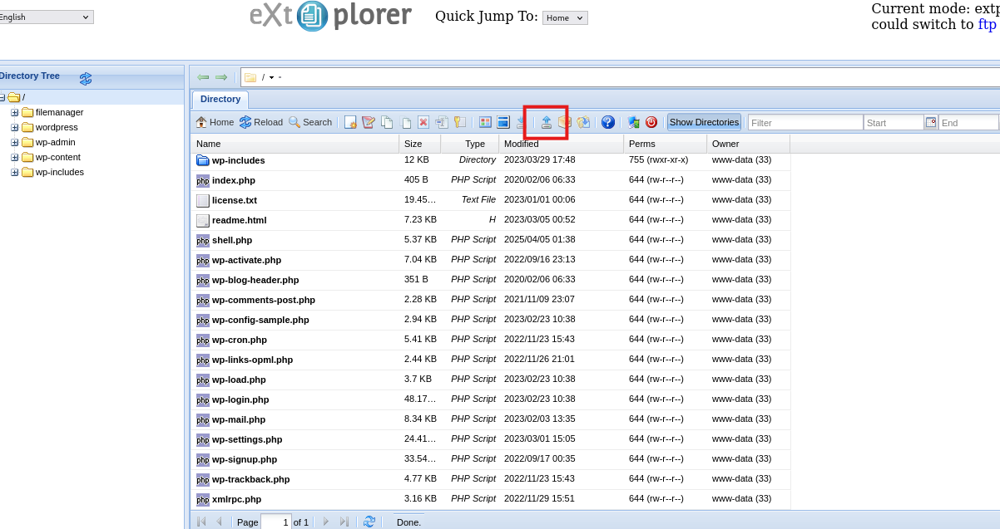

This icon looks like it has upload functionality. Upload a basic `php` reverse shell from `pentestmonkey`:

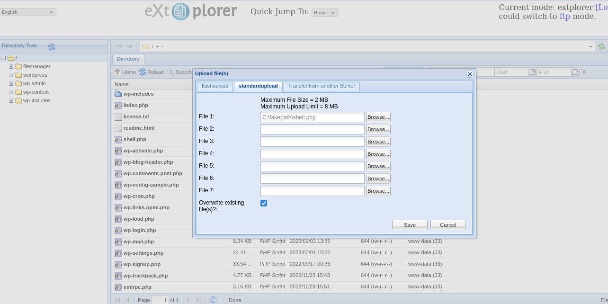

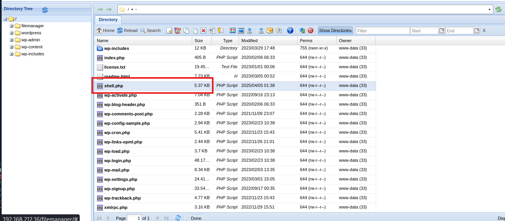

Have a `nc` listener on port `80`, and then trigger the file with this command:

```
curl http://<target ip>/shell.php
```

Side note: the `url` is actually `http://<target ip>/filemanager/shell.php`, but by using this instead we error out:

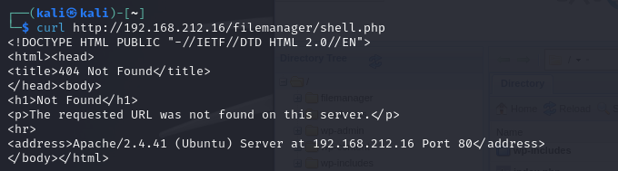

So by omitting it we get this:

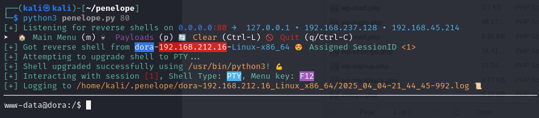

Awesome, got a shell!

We've gained an initial foothold, so it's possible that we can switch to `dora` using the password we've cracked before.

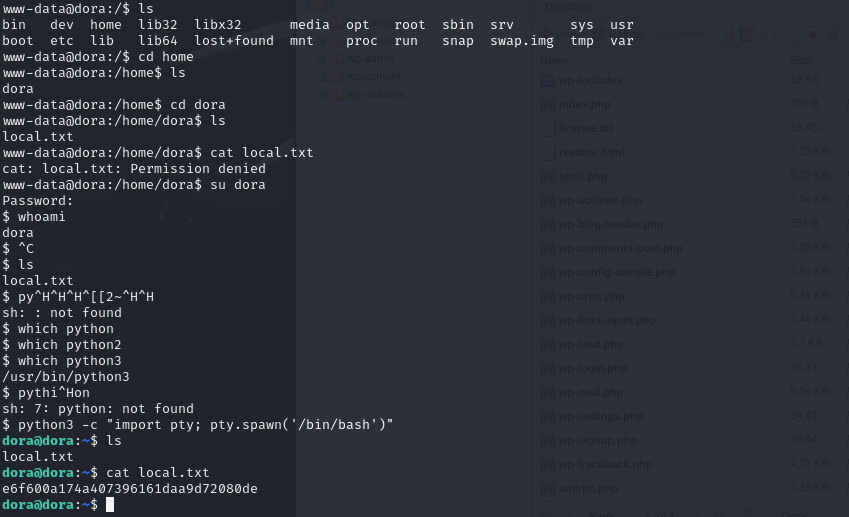

After grabbing `local.txt` let's transfer `linpeas` over and find anything interesting:

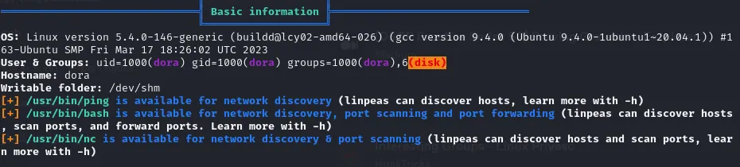

`dora` being a part of the `disk` group is incredibly useful. We can run `df -h` and have a deeper look into the filesystem of the machine:

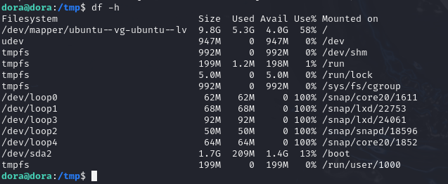

Windows works with physical HDDs and SSDs like `C:\` and `D:\`. In linux, it works a little differently: data is stored in virtual block devices, and that's what each entry here represents. So, `/dev/mapper/ubuntu--vg-ubuntu--lv` is a block device mounted at the root `/` of the machine. Now, as a member of the `disk` group we're able to bypass any permissions if we have direct access to data. So as `dora` we can run `debugfs` which can output contents of any folder or file, including incredibly sensitive ones.

```
debugfs -w /dev/mapper/ubuntu--vg-ubuntu--lv
```

After entering "debug" mode we can extract contents from `/etc/shadow`:

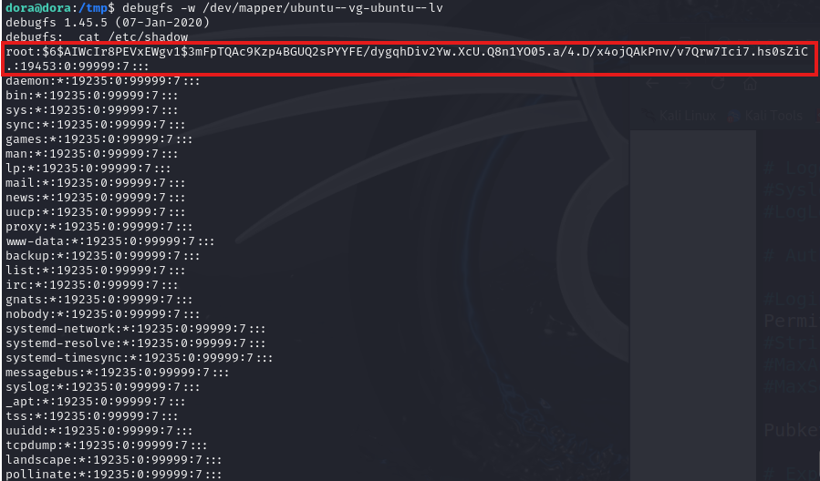

Store this hash in `hash.txt` and crack it with `john` like before:

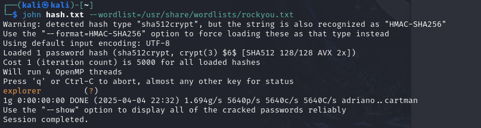

Switch to `root` with `su root` and type in `explorer`:

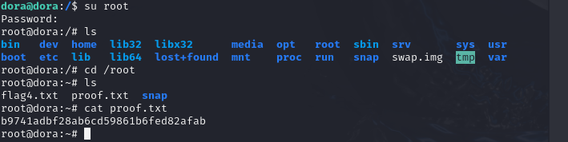

Rooted! :partying_face:
