Nibbles is an intermediate Proving Grounds box, also rated as intermediate by the community. After gaining an initial foothold through `RCE`, we discover an interesting `SUID` binary with `find`, and from there we can escalate privileges.

`nmap` scan:

```
nmap <target ip> -sS -Pn -p-
```

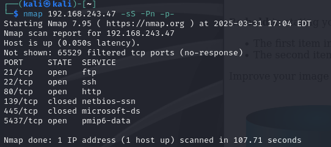

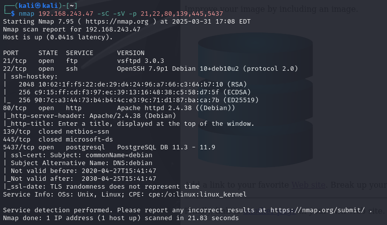

Let's try using `gobuster` on port 80:

```
gobuster dir -u http://<target ip> -w /usr/share/wordlists/dirbuster/directory-list-2.3-medium.txt
```

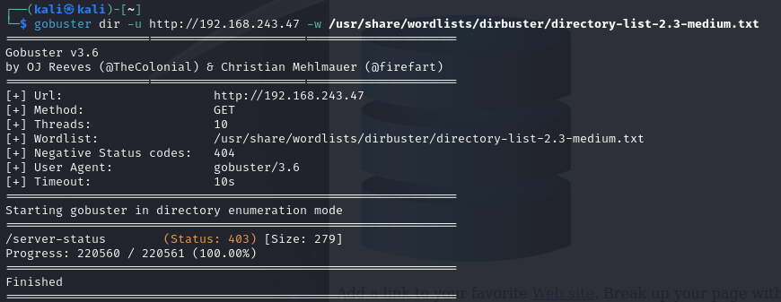

Nothing of interest, but we do we the `postgresql` port open so let's connect to it. Before finding actual usernames or passwords we can attempt default credentials. Google `list of postgresql usernames and passwords`:

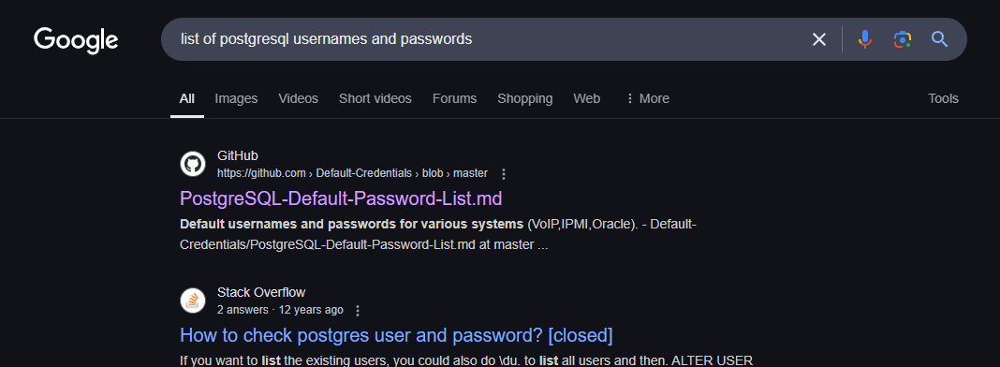

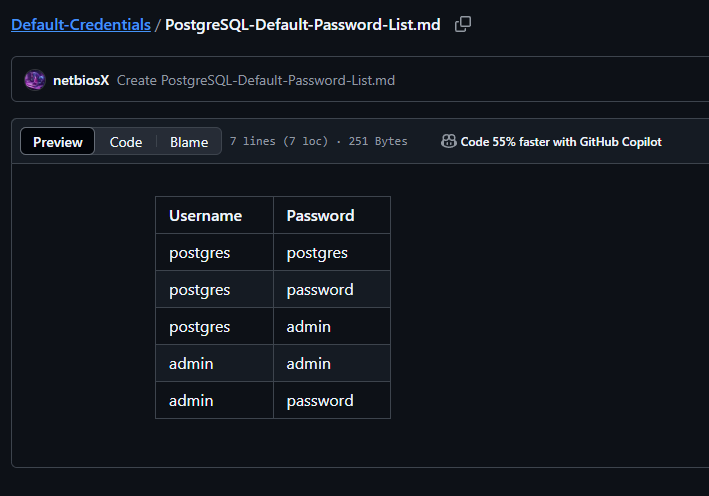

Okay, now connect to `postgresql` and try using `postgres` as the password:

```
psql -h <target ip> -p 5437 -U postgres
```

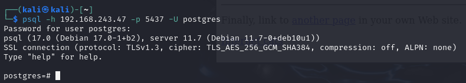

Nice! next to `psql` we can see the version of the service, `server 11.7`.

We might be able to find an exploit through enumerating this version of postgres through `searchsploit` and `Google`:

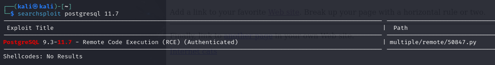

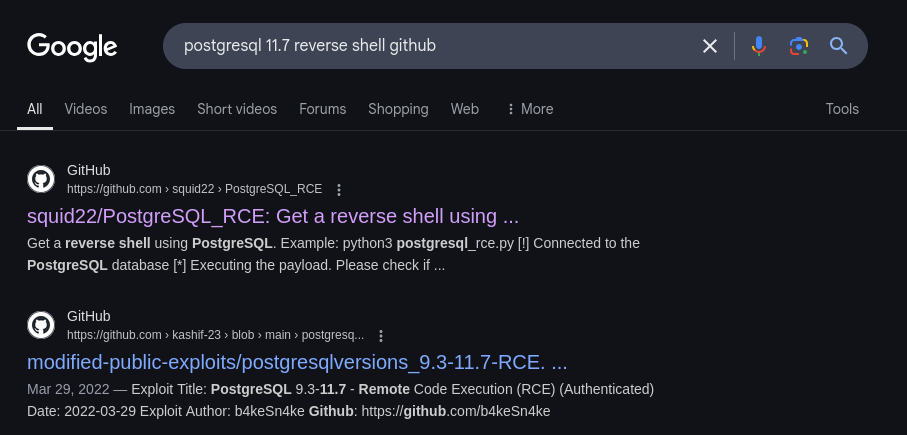

Results with `RCE` is always great news. Most likely will have an easier time gaining the initial foothold.

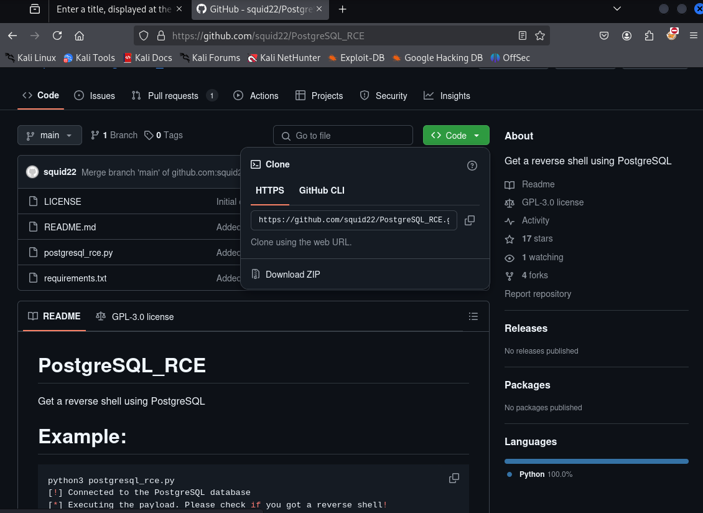

Clone the repo and follow the instructions:

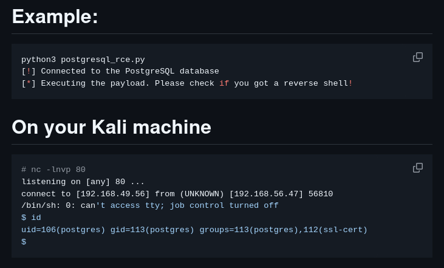

Within the exploit, don't forget to modify the data highlighted (`RHOST` and `RPORT` refer to the target machine, `LHOST` and `LPORT` are the attacker machine):

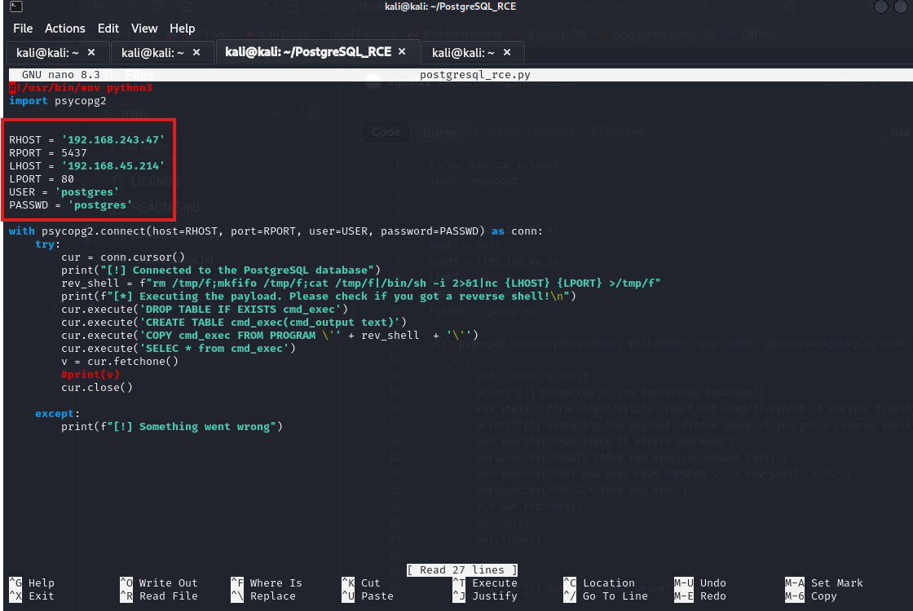

Have a listener on port 80 and then run the exploit:

```
nc -nlvp 80
```

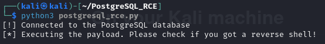

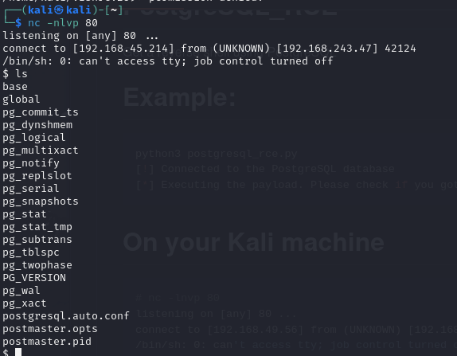

Nice, we received a shell. Can we retrieve `local.txt`?

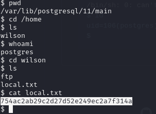

Check to see if any `SUID` binaries are available:

```
find / -type f -perm -4000 2>/dev/null
```

`find` itself is a binary with an `SUID` bit, so let's look it up on `GTFOBins`:

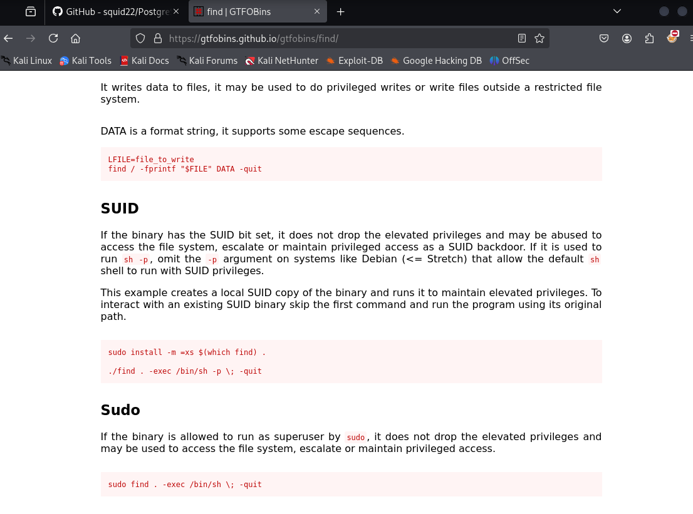

By running the `find` command from its full path in this manner (Under the `SUID` section) we gain elevated privileges. First let's see where `find` is:

```
which find
```

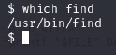

Now, execute the line from `gtfobins`:

```
/usr/bin/find . -exec /bin/sh -p \; -quit
```

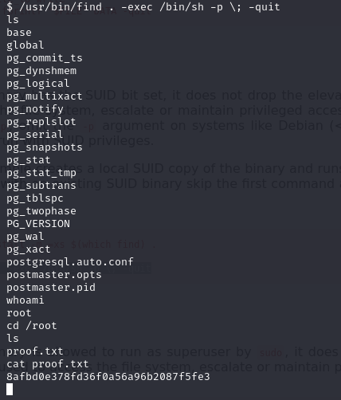

Rooted! :partying_face:
