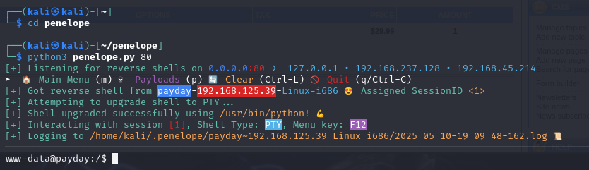

Payday is an intermediate Proving Grounds box, also rated as intermediate by the community. An outdated version of the CS Cart service allows for a malicious file upload which gives us a shell. Discovering a pattern in database credentials leads us to log in as another user who has access to all `sudo` commands.

Start with a simple `nmap` scan:

```
nmap <target ip> -sC -sS -sV -Pn -p- -T4 --min-rate 10000
```


Port 80 seems to be open and also the easiest to check. Let's use `dirsearch` as well:

```
python3 dirsearch.py -u <target ip>:8080 -e html,txt,php -x 400,401,403,404
```


Under the Autehntication tab on the right we have a login field. We'll attempt a login with default credentials like `admin:admin`:


Nice, it worked!

By visiting `/admin` after logging in as `admin` we land here:


Looking at the header of this page and in various spots of the landing page we can surmise that a service called `CS Cart` must be in use. Let's enumerate it with `searchsploit` and `Google`:


This is great, we see a lot of exploits including `RCE`, `LFI` and `Remote File Inclusion` which are all good signs of a compromised service.


This Github repository `cs cart authenticated RCE` seems interesting, let's check it out:


Following the steps of this repo we visit `/admin` again. Under `LOOK AND FEEL` in the right sidebar of the page we click `Template editor`:


Prepare a reverse shell script (Google `pentestmonkey reverse shell`):


Rename the script with a `.phtml` extension:


Have an `nc` listener on port 80 and then visit `http://<target ip>/skins/reverse_shell.phtml`:




Awesome, looks like we got a shell! See if we can grab `local.txt`:


Despite being `www-data`, we were able to `cd` into `patrick`'s directory. We may need to login as `patrick` later on.

Under `/var/www` we discover a potentially sensitive file `config.php`. Use `cat` to extract contents from it:


If database credentials have the same username and password, it might be the case that other parts of this machine follow the same pattern. It couldn't hurt to try logging in as `patrick` with the password `patrick`:

```
su patrick
```


Cool, let's see if `patrick` has any available `sudo` commands:

```
sudo -l
```


This means that `patrick` can use any command under `sudo`. Makes our job a lot easier, all we need to do is switch to the `root` user:

```
sudo su root
```


Rooted! :partying_face:
