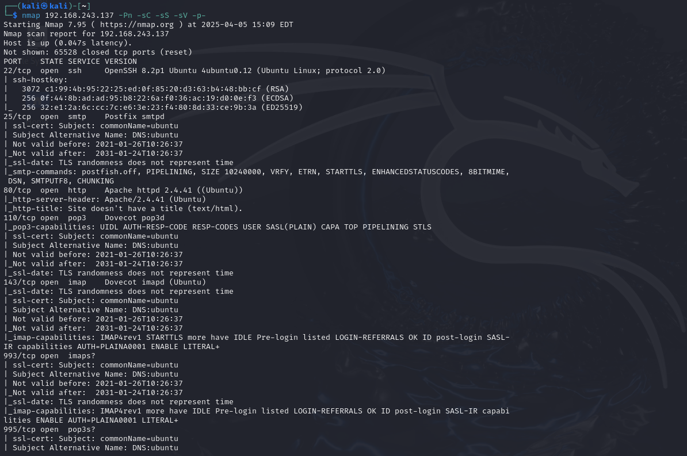
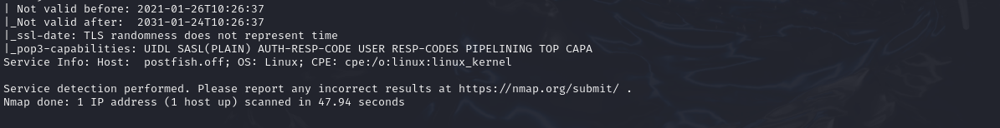
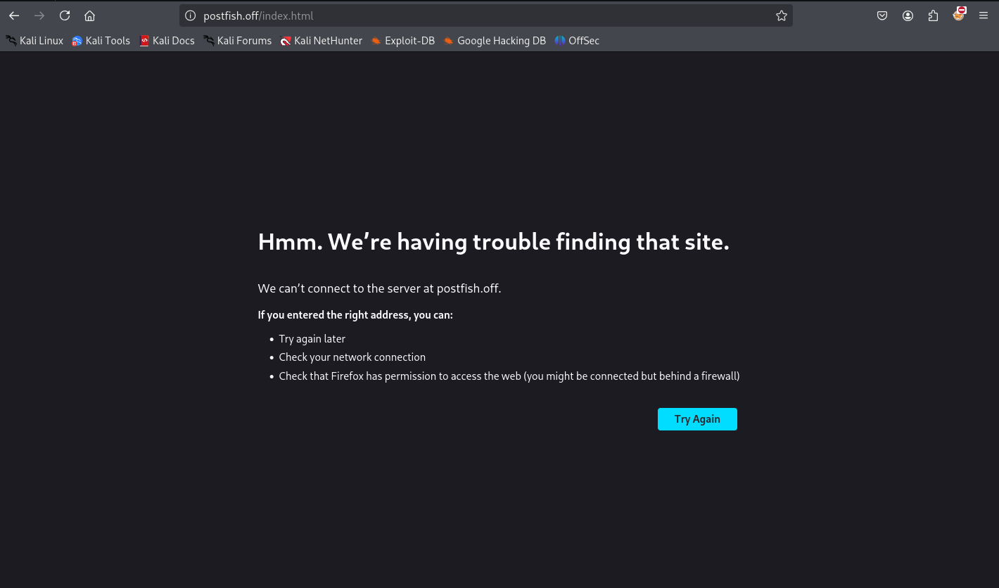
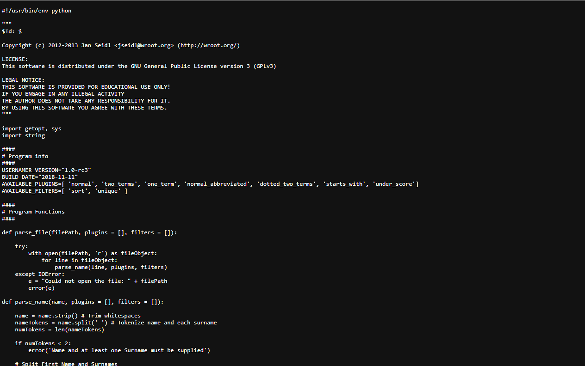
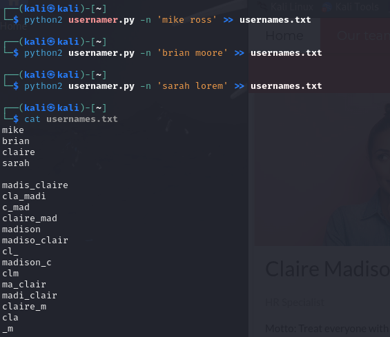
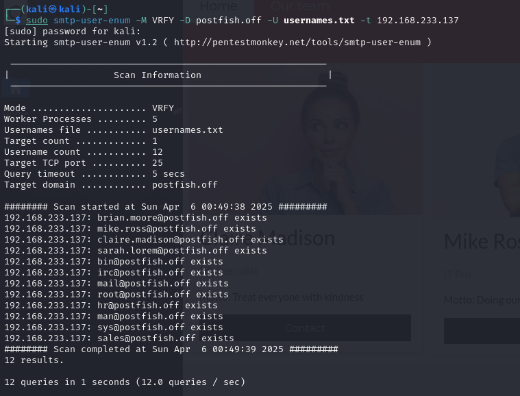
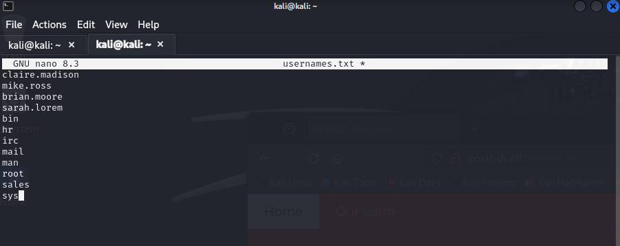

Postfish is an intermediate Proving Grounds box, also rated as very hard by the community. We gain an initial foothold through a phishing campaign. After that, privilege escalation is achieved by exploiting the `mail` binary.

`nmap` scan:

```
nmap <target ip> -Pn -sC -sS -sV -p-
```





Notice that this machine uses `SMTP` on port `25`. Check port `80` first:



Our `/etc/hosts` file needs this domain name, so we'll map the target IP and `postfish.off` to our `/etc/hosts` file:


We see a list of names on the "Meet Out Team" page. These could be potential usernames. To generate possible usernames from them we'll use a tool called `usernamer` which can be found [here](https://github.com/jseidl/usernamer/tree/master).

The raw file of the tool is also provided [here](https://raw.githubusercontent.com/jseidl/usernamer/refs/heads/master/usernamer.py):



To generate usernames, add each name in a separate text file with `usernamer.py`:

```
python2 usernamer.py -n '<full name>' >> usernames.txt
```

Note: `python3` doesn't work with `usernamer` so we had to use `python2`.



Thinking back to our `nmap` scan, we know that the target machine is using `SMTP` which is a mailing service. Some combination of usernames and `postfish` could exist as emails, so we'll enumerate `SMTP` with our `usernames.txt` file:

```
sudo smtp-user-enum -M VRFY -D postfish.off -U usernames.txt -t <target ip>
```



Cool, found some valid usernames and emails.

Compile this list and the list from earlier into one textfile, then we can brute force for passwords:


